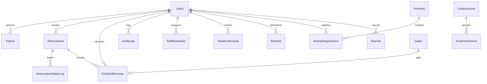
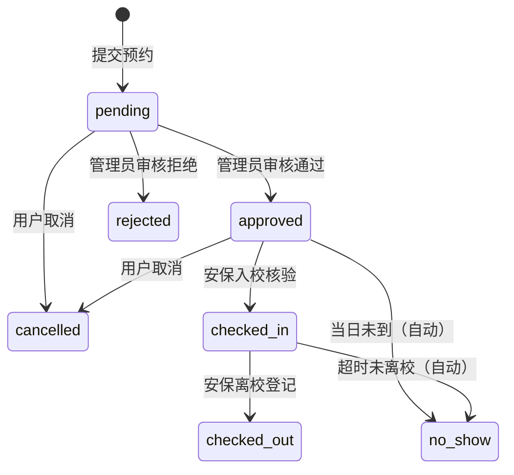

# 校园开放预约与访客管理系统 - 数据库设计

## 执行步骤

### 在 SSMS 中执行

1. 打开 SQL Server Management Studio (SSMS)
2. 连接到你的本地 SQL Server 实例
3. 打开 `01-init.sql`，点击 **执行 (F5)**
4. 打开 `02-seed-data.sql`，点击 **执行 (F5)**

> 数据库名称：`CampusVisitorDB`

---

## ER 图（表关系概览）

---

## 数据字典（16张表）

### 1. Users（用户表）
| 字段 | 类型 | 说明 |
|------|------|------|
| Id | INT PK | 用户ID |
| Name | NVARCHAR(50) | 姓名 |
| Phone | VARCHAR(20) | 手机号（登录账号） |
| PasswordHash | VARCHAR(256) | 密码哈希 |
| Role | VARCHAR(20) | 角色：visitor/admin/security/staff |
| IsActive | BIT | 是否激活 |
| CreatedAt | DATETIME2 | 注册时间 |

### 2. Visitors（访客信息）
| 字段 | 类型 | 说明 |
|------|------|------|
| UserId | INT FK | 关联用户 |
| IdCard | VARCHAR(20) | 身份证号 |
| VisitorType | VARCHAR(20) | 访客类型：parent/alumni/tourist/study_group/partner |
| Affiliation | NVARCHAR(100) | 所属单位 |

### 3. Reservations（预约申请表 - 核心表）
| 字段 | 类型 | 说明 |
|------|------|------|
| Id | INT PK | 预约ID |
| ReservationNo | VARCHAR(30) | 预约编号（自动生成） |
| VisitorType | VARCHAR(20) | 访客类型 |
| VisitDate | DATE | 参观日期 |
| TimeSlot | VARCHAR(20) | 时段：morning/afternoon/full_day |
| Status | VARCHAR(20) | **状态：pending→approved→checked_in→checked_out / rejected/cancelled/no_show** |
| ReviewerId | INT FK | 审核人 |

### 4. ReservationStatusLog（状态变更日志）
记录预约从创建到结束的每一次状态变化，全程可追溯。

### 5. CampusAreas（校园区域）
| 字段 | 说明 |
|------|------|
| Name | 区域名称 |
| Type | public/academic/office/living/lab/restricted |
| AccessLevel | public/restricted/forbidden |

### 6. AreaPermissions（区域权限）
多对多关系：哪些访客类型允许进入哪些区域。

### 7. OpenRules（开放规则）
配置校园开放日期、时段和容量上限。支持工作日/周末/节假日/考试周/自定义。

### 8. Activities（活动）
| 字段 | 说明 |
|------|------|
| Title | 活动标题 |
| MaxParticipants | 人数上限 |
| CurrentCount | 当前报名数 |
| Status | draft/open/closed/cancelled |

### 9. ActivityRegistrations（活动报名）

### 10. EntryExitRecords（出入校记录）
记录入校时间、入校校门、离校时间、离校校门。

### 11. Gates（校门）
南门、北门、东门、西门。

### 12. ViolationRecords（违规记录）
系统自动记录+人工录入+举报转化三种来源。

### 13. Blacklist（黑名单）
| 字段 | 说明 |
|------|------|
| UserId | 被拉黑用户 |
| ViolationCount | 累计违规次数 |
| ExpiresAt | 到期时间（NULL=永久） |

### 14. Reports（举报）
举报→待审核→通过（转为违规记录）/ 驳回。

### 15. StaffSchedules（排班）
支持按角色（志愿者/讲解员/安保）分配时段和工作地点，唯一约束防止排班冲突。

### 16. AuditLogs（审计日志）
全量记录后台操作：审核、配置修改、用户管理、数据导出等。

---

## 预约状态流转图

---

## 角色与权限

| 角色 | 可访问端 | 主要权限 |
|------|---------|---------|
| **访客 (visitor)** | 访客端 | 提交预约、报名活动、查看个人记录 |
| **管理员 (admin)** | 管理后台 | 审核预约、配置规则、管理区域/活动/黑名单/排班、查看审计日志 |
| **安保 (security)** | 安保工作站 | 入校核验、离校登记、查看在校访客、提交举报 |
| **工作人员 (staff)** | -- | 讲解员、志愿者（后端排班管理） |
