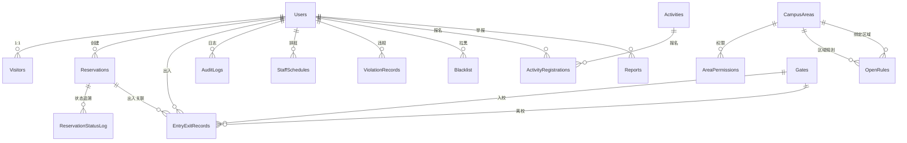
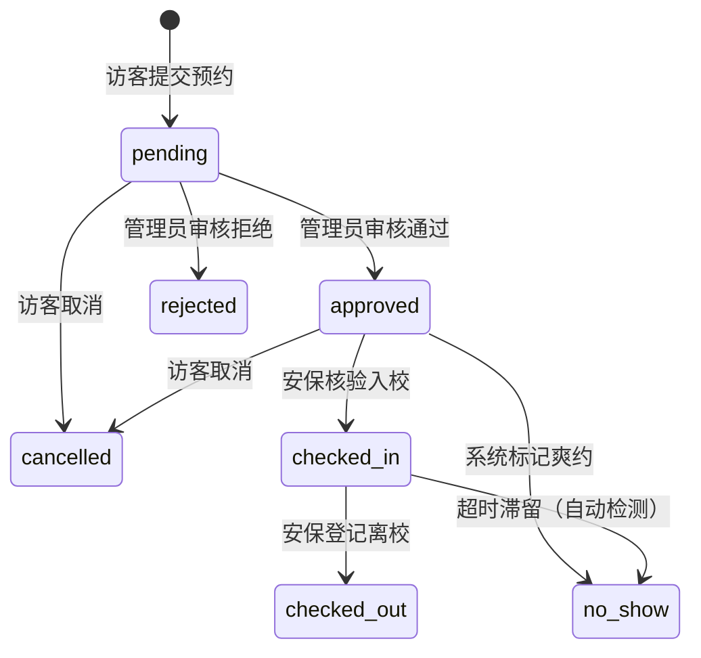

# 校园开放预约与访客管理系统 — 数据库设计

> **数据库名称**：`CampusVisitorDB` | **引擎**：SQL Server 2019 | **表数量**：16 张
> **配套报告**：`../课程报告-校园开放预约与访客管理系统.md`
> **后端**：ASP.NET Core 8.0.11 + EF Core 8.0.11 + BCrypt.Net-Next 4.0.3 + AutoMapper 12.0.1
> **前端**：Vue 3.5.13 + Element Plus 2.9.0 + Vite 6.1.0 + Axios 1.7.0 + Vue Router 4.5.0 + Pinia 3.0.0

---

## 🚀 快速部署

| 方式                       | 文件                                    | 说明                                                           |
| -------------------------- | --------------------------------------- | -------------------------------------------------------------- |
| **一键部署**（推荐） | `00-full-backup.sql`                  | SSMS 打开按 F5，建库+建表+约束+索引+种子数据                   |
| **分步部署**         | `01-init.sql` → `02-seed-data.sql` | 先建结构（16表+触发器+索引），再灌数据                         |
| **后端自动**         | 启动`dotnet run`                      | EF Core EnsureCreated + Program.cs 自动创建触发器 + 密码重哈希 |

---

## ER 图（表关系概览）



---

## 数据字典（16 张表）

> 完整 SQL 见 `01-init.sql`。以下列出每张表的核心字段。

### 1. Users（用户表）— 统一身份

| 字段                | 类型         | 约束                                | 说明               |
| ------------------- | ------------ | ----------------------------------- | ------------------ |
| Id                  | INT          | PK, IDENTITY                        | 用户ID             |
| Name                | NVARCHAR(50) | NOT NULL                            | 姓名               |
| Phone               | VARCHAR(20)  | NOT NULL, UNIQUE                    | 手机号（登录账号） |
| PasswordHash        | VARCHAR(256) | NOT NULL                            | BCrypt 哈希        |
| Role                | VARCHAR(20)  | CHECK(visitor/admin/security/staff) | 角色               |
| Email               | VARCHAR(100) | NULL                                | 邮箱               |
| IsActive            | BIT          | DEFAULT 1                           | 是否激活           |
| CreatedAt/UpdatedAt | DATETIME2    | DEFAULT GETDATE()                   | 时间戳             |
| LastLoginAt         | DATETIME2    | NULL                                | 最后登录           |

### 2. Visitors（访客扩展表）— 1:1 关联 Users

| 字段             | 类型          | 约束                                             | 说明       |
| ---------------- | ------------- | ------------------------------------------------ | ---------- |
| Id               | INT           | PK                                               | 记录ID     |
| UserId           | INT           | FK → Users                                      | 关联用户   |
| IdCard           | VARCHAR(20)   | NULL                                             | 身份证号   |
| Gender           | VARCHAR(4)    | CHECK(男/女/其他)                                | 性别       |
| BirthDate        | DATE          | NULL                                             | 出生日期   |
| Affiliation      | NVARCHAR(100) | NULL                                             | 所属单位   |
| VisitorType      | VARCHAR(20)   | CHECK(parent/alumni/tourist/study_group/partner) | 访客类型   |
| EmergencyContact | NVARCHAR(50)  | NULL                                             | 紧急联系人 |
| EmergencyPhone   | VARCHAR(20)   | NULL                                             | 紧急电话   |
| Remarks          | NVARCHAR(500) | NULL                                             | 备注       |

### 3. Reservations（预约申请表）— 核心表

| 字段                | 类型                     | 约束                                                                           | 说明               |
| ------------------- | ------------------------ | ------------------------------------------------------------------------------ | ------------------ |
| Id                  | INT                      | PK                                                                             | 预约ID             |
| ReservationNo       | VARCHAR(30)              | UNIQUE                                                                         | R+yyyyMMdd+4位序号 |
| VisitorType         | VARCHAR(20)              | CHECK(parent/alumni/tourist/study_group/partner)                               | 访客类型           |
| VisitorName/Phone   | NVARCHAR(50)/VARCHAR(20) | NOT NULL                                                                       | 访客信息           |
| VisitDate           | DATE                     | NOT NULL                                                                       | 参观日期           |
| TimeSlot            | VARCHAR(20)              | CHECK(morning/afternoon/full_day)                                              | 时段               |
| Companions          | INT                      | DEFAULT 0                                                                      | 同行人数           |
| StayDuration        | VARCHAR(20)              | NULL                                                                           | 预计停留           |
| Purpose             | NVARCHAR(500)            | NOT NULL                                                                       | 事由               |
| **Status**    | VARCHAR(20)              | CHECK(pending→approved→checked_in→checked_out / rejected/cancelled/no_show) | **状态**     |
| ReviewerId          | INT                      | FK → Users                                                                    | 审核人             |
| ReviewRemark        | NVARCHAR(500)            | NULL                                                                           | 审核备注           |
| ReviewedAt          | DATETIME2                | NULL                                                                           | 审核时间           |
| CreatedAt/UpdatedAt | DATETIME2                | DEFAULT GETDATE()                                                              | 时间戳             |

### 4. ReservationStatusLog（状态变更日志）— 触发器自动写入

| 字段                | 类型                   | 说明         |
| ------------------- | ---------------------- | ------------ |
| Id                  | INT PK                 | 日志ID       |
| ReservationId       | INT FK → Reservations | 关联预约     |
| FromStatus/ToStatus | VARCHAR(20)            | 变更前后状态 |
| OperatorId          | INT FK → Users        | 操作人       |
| Remark              | NVARCHAR(500)          | 备注         |
| CreatedAt           | DATETIME2              | 记录时间     |

### 5. CampusAreas（校园区域）

| 字段               | 类型          | 约束                                                | 说明     |
| ------------------ | ------------- | --------------------------------------------------- | -------- |
| Id                 | INT           | PK                                                  | 区域ID   |
| Name               | NVARCHAR(100) | NOT NULL                                            | 名称     |
| Code               | VARCHAR(20)   | UNIQUE                                              | 编码     |
| Type               | VARCHAR(20)   | CHECK(public/academic/office/living/lab/restricted) | 类型     |
| AccessLevel        | VARCHAR(20)   | CHECK(public/restricted/forbidden)                  | 开放等级 |
| Description        | NVARCHAR(500) | NULL                                                | 描述     |
| MorningStart/End   | TIME          | NULL                                                | 上午时段 |
| AfternoonStart/End | TIME          | NULL                                                | 下午时段 |
| IsActive           | BIT           | DEFAULT 1                                           | 启用     |

### 6. AreaPermissions（区域权限）— 多对多

| 字段        | 类型                                    | 约束                                             |
| ----------- | --------------------------------------- | ------------------------------------------------ |
| Id          | INT PK                                  | —                                               |
| AreaId      | INT FK → CampusAreas ON DELETE CASCADE | 区域                                             |
| VisitorType | VARCHAR(20)                             | CHECK(parent/alumni/tourist/study_group/partner) |
| —          | UNIQUE(AreaId, VisitorType)             | 复合唯一约束                                     |

### 7. Gates（校门表）

| 字段     | 类型         | 约束      |
| -------- | ------------ | --------- |
| Id       | INT PK       | —        |
| Name     | NVARCHAR(50) | NOT NULL  |
| Code     | VARCHAR(20)  | UNIQUE    |
| IsActive | BIT          | DEFAULT 1 |

### 8. OpenRules（开放规则）— 支持区域绑定

| 字段               | 类型          | 约束                                       | 说明                   |
| ------------------ | ------------- | ------------------------------------------ | ---------------------- |
| Id                 | INT PK        | —                                         | 规则ID                 |
| **AreaId**   | INT NULL      | FK → CampusAreas ON DELETE SET NULL       | 关联区域（NULL=全校）  |
| DateType           | VARCHAR(20)   | CHECK(weekday/weekend/holiday/exam/custom) | 日期类型               |
| StartDate/EndDate  | DATE          | NOT NULL                                   | 生效日期范围           |
| TimeSlot           | VARCHAR(20)   | CHECK(morning/afternoon/full_day)          | 时段                   |
| MorningStart/End   | TIME          | DEFAULT 08:00/12:00                        | 上午时间               |
| AfternoonStart/End | TIME          | DEFAULT 12:00/17:00                        | 下午时间（违规检测用） |
| MaxCapacity        | INT           | DEFAULT 500                                | 容量上限               |
| IsActive           | BIT           | DEFAULT 1                                  | 启用                   |
| Remark             | NVARCHAR(500) | NULL                                       | 备注                   |

### 9. Activities（活动表）

| 字段                | 类型            | 约束                               | 说明                    |
| ------------------- | --------------- | ---------------------------------- | ----------------------- |
| Id                  | INT PK          | —                                 | 活动ID                  |
| Title/Location      | NVARCHAR(200)   | NOT NULL                           | 标题/地点               |
| Description         | NVARCHAR(2000)  | NULL                               | 描述                    |
| StartTime/EndTime   | DATETIME2       | NOT NULL                           | 时间（过期自动 closed） |
| MaxParticipants     | INT             | DEFAULT 100                        | 人数上限                |
| CurrentCount        | INT             | DEFAULT 0                          | 当前报名数（冗余）      |
| Status              | VARCHAR(20)     | CHECK(draft/open/closed/cancelled) | 状态                    |
| CoverImage          | VARCHAR(500)    | NULL                               | 封面                    |
| ContactPerson/Phone | NVARCHAR(50)/20 | NULL                               | 联系人                  |
| CreatedBy           | INT             | FK → Users                        | 创建人                  |

### 10. ActivityRegistrations（活动报名）

| 字段              | 类型                       | 约束                                          | 说明     |
| ----------------- | -------------------------- | --------------------------------------------- | -------- |
| Id                | INT PK                     | —                                            | 报名ID   |
| ActivityId        | INT FK → Activities       | —                                            | 活动     |
| UserId            | INT FK → Users            | —                                            | 用户     |
| VisitorName/Phone | NVARCHAR(50)/20            | NOT NULL                                      | 报名人   |
| Companions        | INT                        | DEFAULT 0                                     | 同行     |
| Status            | VARCHAR(20)                | CHECK(registered/cancelled/checked_in/absent) | 状态     |
| CheckedInAt       | DATETIME2                  | NULL                                          | 签到时间 |
| CreatedAt         | DATETIME2                  | DEFAULT GETDATE()                             | 报名时间 |
| —                | UNIQUE(ActivityId, UserId) | 一人一活动只能报一次                          |          |

### 11. EntryExitRecords（出入校记录）

| 字段                   | 类型                   | 约束              | 说明        |
| ---------------------- | ---------------------- | ----------------- | ----------- |
| Id                     | INT PK                 | —                | 记录ID      |
| ReservationId          | INT FK → Reservations | —                | 关联预约    |
| UserId                 | INT FK → Users        | —                | 用户        |
| EntryTime/ExitTime     | DATETIME2              | NULL              | 入/离校时间 |
| EntryGateId/ExitGateId | INT FK → Gates        | NULL              | 入/离校校门 |
| OperatorId             | INT FK → Users        | NULL              | 核验安保    |
| CreatedAt              | DATETIME2              | DEFAULT GETDATE() | 记录时间    |

### 12. ViolationRecords（违规记录）

| 字段          | 类型            | 约束                                                                        | 说明                   |
| ------------- | --------------- | --------------------------------------------------------------------------- | ---------------------- |
| Id            | INT PK          | —                                                                          | 记录ID                 |
| UserId        | INT FK → Users | —                                                                          | 违规用户               |
| ViolationType | VARCHAR(20)     | CHECK(no_show/overstay/trespass/duplicate/absence/disturbance/damage/other) | 类型                   |
| Description   | NVARCHAR(1000)  | NOT NULL                                                                    | 描述                   |
| OccurredAt    | DATETIME2       | NOT NULL                                                                    | 发生时间               |
| Location      | NVARCHAR(200)   | NULL                                                                        | 地点（含区域名）       |
| Severity      | VARCHAR(10)     | CHECK(minor/major/critical)                                                 | 严重程度               |
| SourceType    | VARCHAR(20)     | CHECK(system/report/manual)                                                 | 来源（系统/举报/人工） |
| SourceId      | INT             | NULL                                                                        | 来源记录ID             |
| CreatedAt     | DATETIME2       | DEFAULT GETDATE()                                                           | 创建时间               |

### 13. Blacklist（黑名单）

| 字段              | 类型          | 约束                | 说明              |
| ----------------- | ------------- | ------------------- | ----------------- |
| Id                | INT PK        | —                  | 记录ID            |
| UserId            | INT           | FK → Users, UNIQUE | 被拉黑用户        |
| Reason            | NVARCHAR(500) | NOT NULL            | 拉黑原因          |
| ViolationCount    | INT           | DEFAULT 0           | 累计违规次数      |
| BlacklistedAt     | DATETIME2     | DEFAULT GETDATE()   | 拉黑时间          |
| ExpiresAt         | DATETIME2     | NULL                | 到期（NULL=永久） |
| IsActive          | BIT           | DEFAULT 1           | 是否生效          |
| OperatorId        | INT           | FK → Users         | 操作人            |
| UnblacklistedAt   | DATETIME2     | NULL                | 移出时间          |
| UnblacklistReason | NVARCHAR(500) | NULL                | 移出原因          |

### 14. Reports（举报表）

| 字段          | 类型            | 约束                                              | 说明       |
| ------------- | --------------- | ------------------------------------------------- | ---------- |
| Id            | INT PK          | —                                                | 举报ID     |
| ReporterId    | INT FK → Users | —                                                | 举报人     |
| TargetName    | NVARCHAR(100)   | NOT NULL                                          | 被举报对象 |
| ViolationType | VARCHAR(20)     | CHECK(trespass/disturbance/damage/overstay/other) | 违规类型   |
| Location      | NVARCHAR(200)   | NOT NULL                                          | 地点       |
| OccurredAt    | DATETIME2       | NOT NULL                                          | 时间       |
| Description   | NVARCHAR(2000)  | NOT NULL                                          | 描述       |
| Evidence      | NVARCHAR(MAX)   | NULL                                              | 举证       |
| Status        | VARCHAR(20)     | CHECK(pending/approved/rejected)                  | 审核状态   |
| ReviewerId    | INT FK → Users | NULL                                              | 审核人     |
| ReviewRemark  | NVARCHAR(500)   | NULL                                              | 审核备注   |
| ReviewedAt    | DATETIME2       | NULL                                              | 审核时间   |
| CreatedAt     | DATETIME2       | DEFAULT GETDATE()                                 | 创建时间   |

### 15. StaffSchedules（排班表）

| 字段              | 类型                             | 约束                                      | 说明     |
| ----------------- | -------------------------------- | ----------------------------------------- | -------- |
| Id                | INT PK                           | —                                        | 排班ID   |
| StaffId           | INT FK → Users                  | —                                        | 工作人员 |
| StaffRole         | VARCHAR(20)                      | CHECK(volunteer/guide/security)           | 角色     |
| WorkDate          | DATE                             | NOT NULL                                  | 日期     |
| Shift             | VARCHAR(20)                      | CHECK(morning/afternoon/evening/full_day) | 班次     |
| StartTime/EndTime | TIME                             | NOT NULL                                  | 时间     |
| Location          | NVARCHAR(200)                    | NOT NULL                                  | 地点     |
| Task              | NVARCHAR(500)                    | NULL                                      | 工作内容 |
| CreatedBy         | INT FK → Users                  | —                                        | 排班人   |
| CreatedAt         | DATETIME2                        | DEFAULT GETDATE()                         | 创建时间 |
| UpdatedAt         | DATETIME2                        | DEFAULT GETDATE()                         | 更新时间 |
| —                | UNIQUE(StaffId, WorkDate, Shift) | 防排班冲突                                |          |

### 16. AuditLogs（审计日志）

| 字段         | 类型            | 约束                                                                           | 说明     |
| ------------ | --------------- | ------------------------------------------------------------------------------ | -------- |
| Id           | BIGINT PK       | IDENTITY                                                                       | 日志ID   |
| OperatorId   | INT FK → Users | NULL                                                                           | 操作人   |
| ActionType   | VARCHAR(30)     | CHECK(login/review/config/user_mgmt/data_export/blacklist/report/system/other) | 操作类型 |
| ActionDetail | NVARCHAR(500)   | NOT NULL                                                                       | 详情     |
| TargetType   | VARCHAR(50)     | NULL                                                                           | 对象类型 |
| TargetId     | INT             | NULL                                                                           | 对象ID   |
| IpAddress    | VARCHAR(50)     | NULL                                                                           | IP       |
| Result       | VARCHAR(10)     | CHECK(success/fail)                                                            | 结果     |
| CreatedAt    | DATETIME2       | DEFAULT GETDATE()                                                              | 时间     |

---

## 预约状态流转图



---

## 核心业务流程（对应数据库表）

```Shell
flowchart TD
    A[访客登录] --> B{Blacklist检查<br/>IsActive=1 AND ExpiresAt>NOW}
    B -->|是| B1[401 拒绝]
    B -->|否| C[提交预约<br/>INSERT Reservations]
    C --> D[管理员审核<br/>UPDATE Reservations SET Status]
    D -->|approved| E[安保入校核验<br/>UPDATE Status + INSERT EntryExitRecords]
    D -->|rejected| D2[结束]
    E --> F[在校参观]
    F --> G[安保离校登记<br/>UPDATE ExitTime + Status]
    F --> I{AutoDetectViolationsAsync<br/>每日自动触发}
    I --> I1[爽约: approved过期<br/>→INSERT ViolationRecord]
    I --> I2[超时滞留: 超区域关闭时间<br/>→INSERT ViolationRecord]
    I --> I3[越权: VisitorType无权限<br/>→INSERT ViolationRecord]
    I1 & I2 & I3 --> J{SELECT COUNT(*)>=3?}
    J -->|是| K[INSERT Blacklist<br/>ExpiresAt=NOW+3月]
    K --> B
    L[提交举报<br/>INSERT Reports] --> M[审核通过<br/>INSERT ViolationRecord<br/>SourceType=report]
    M --> J
```

| 节点       | 数据库表                                    | 关键SQL                                                |
| ---------- | ------------------------------------------- | ------------------------------------------------------ |
| 黑名单检查 | `Blacklist`                               | `SELECT WHERE IsActive=1 AND ExpiresAt>GETUTCDATE()` |
| 预约提交   | `Reservations` + `ReservationStatusLog` | INSERT + 触发器                                        |
| 预约审核   | `Reservations`                            | `UPDATE SET Status, ReviewerId, ReviewedAt`          |
| 入校核验   | `EntryExitRecords` + `Reservations`     | INSERT + UPDATE（同一事务）                            |
| 离校登记   | `EntryExitRecords`                        | `UPDATE SET ExitTime WHERE ExitTime IS NULL`         |
| 爽约检测   | `Reservations` + `ViolationRecords`     | `SELECT WHERE Status='approved' AND VisitDate<TODAY` |
| 超时检测   | `OpenRules` + `EntryExitRecords`        | 按 AreaId 分组取关闭时间                               |
| 自动拉黑   | `ViolationRecords` + `Blacklist`        | `GROUP BY UserId HAVING COUNT(*)>=3`                 |

---

## 违规检测与黑名单机制

### 自动检测（`EntryExitService.AutoDetectViolationsAsync`）

| 检测类型 | 触发条件                                 | 结果                                              |
| -------- | ---------------------------------------- | ------------------------------------------------- |
| 爽约     | 预约`approved` 且 `VisitDate < 今天` | → status=no_show + 创建 ViolationRecord          |
| 超时滞留 | 在校访客超过区域关闭时间                 | → 创建 overstay ViolationRecord（含区域名+时长） |
| 越权访问 | 访客类型无权限进入禁止区域               | → 创建 trespass ViolationRecord                  |

### 举报→违规→拉黑链

```
用户提交 Report → 管理员审核通过
  → 自动创建 ViolationRecord（SourceType=report）
  → 累计 ≥3 次 → 自动加入 Blacklist（3个月有效期）
  → 登录时 401 拦截 / 预约时拒绝
```

### 黑名单拦截

| 触发点 | 文件                               | 行为                                     |
| ------ | ---------------------------------- | ---------------------------------------- |
| 登录   | `AuthService.LoginAsync`         | 查询 Blacklist，返回 401 + 原因+截止日期 |
| 预约   | `ReservationService.CreateAsync` | 查询 Blacklist，拒绝创建                 |

---

## 角色与权限

| 角色     | 可访问端   | 主要权限                                                                |
| -------- | ---------- | ----------------------------------------------------------------------- |
| admin    | 管理后台   | 审核预约、规则配置、区域管理、活动管理、黑名单+违规记录、排班、审计日志 |
| security | 安保工作站 | 入校核验、离校登记、在校访客、违规举报                                  |
| visitor  | 访客端     | 提交预约、报名活动、我的预约、个人中心                                  |
| staff    | —         | 讲解员/志愿者（排班管理）                                               |

---

## 关键索引

```sql
-- 预约高频查询
IX_Reservations_UserId, IX_Reservations_Status, IX_Reservations_VisitDate, IX_Reservations_VisitorPhone
-- 出入记录
IX_EER_UserId, IX_EER_EntryTime
-- 审计日志
IX_AL_OperatorId, IX_AL_CreatedAt, IX_AL_ActionType
-- 举报/排班/活动/违规
IX_Rep_Status, IX_SS_WorkDate, IX_AR_ActivityId, IX_VR_UserId
```

## 约束统计

| 类型        | 数量                               |
| ----------- | ---------------------------------- |
| PRIMARY KEY | 16                                 |
| FOREIGN KEY | 26+                                |
| UNIQUE      | 8                                  |
| CHECK       | 19+                                |
| DEFAULT     | 20+                                |
| 触发器      | 1（trg_Reservations_StatusChange） |

### 为什么只有 1 个触发器？

| 自动化逻辑 | 实现方式 | 不用触发器的原因 |
|-----------|---------|----------------|
| 状态变更日志 | **SQL 触发器** ✅ | 单表 INSERT，适合触发器 |
| 爽约/超时/越权检测 | C# `AutoDetectViolationsAsync()` | 需跨 4 表关联查询 |
| 自动拉黑 | C# `AutoBlacklistAsync()` | 需先提交变更再统计 |
| 活动过期关闭 | C# `AutoCloseExpiredAsync()` | 查询时懒触发 |
| 黑名单登录拦截 | C# `LoginAsync()` | 需返回中文错误信息 |

> **设计原则**：SQL 触发器用于简单审计日志；跨表业务逻辑统一用 C# Service 层，便于调试和维护。
