# 校园开放预约与访客管理系统 — 课程设计报告

> **课程名称**：数据库系统课程设计
> **小组成员**：范伟程、韩中信、崔鲡沣
> **完成日期**：2026年6月26日

> **组员分工**：
>
> - 范伟程：系统需求分析、数据库设计与建模、数据库初始化脚本编写
> - 崔鲡沣：后端接口开发、业务逻辑实现、数据库恢复与调试
> - 韩中信：前端页面设计、前端与后端联调、测试与功能演示文档整理

---

## 目录

1. [项目概述](#1-项目概述)

   - 1.1 核心业务流程
   - 1.2 组员分工
2. [需求分析](#2-需求分析)
3. [技术框架选取](#3-技术框架选取)
4. [系统架构设计](#4-系统架构设计)
5. [数据库设计（重点）](#5-数据库设计)

   - 5.1 概念结构设计（ER 图）
   - 5.2 逻辑结构设计（数据字典）
   - 5.3 物理结构设计（约束、索引、触发器、函数）
6. [后端设计](#6-后端设计)
7. [前端设计](#7-前端设计)
8. [成果展示与功能演示](#8-成果展示与功能演示)

   - 8.1 访客端功能
   - 8.2 管理员端功能
   - 8.3 安保端功能
   - 8.4 智能违规检测与黑名单机制
9. [功能与需求对照表](#9-功能与需求对照表)
10. [前端-后端-数据库关联分析](#10-前端-后端-数据库关联分析)
11. [总结与展望](#11-总结与展望)

---

## 1. 项目概述

本系统为**校园一体化访客管理数据库系统**，整合了校园开放预约、访客权限管控、校园活动报名、客流容量控制、安全审计追溯等核心功能。系统面向**校外访客**、**校园管理员**、**安保人员**、**志愿工作人员**四类角色，实现访客入校全流程数字化、规范化、智能化管理。

系统核心业务流程为：

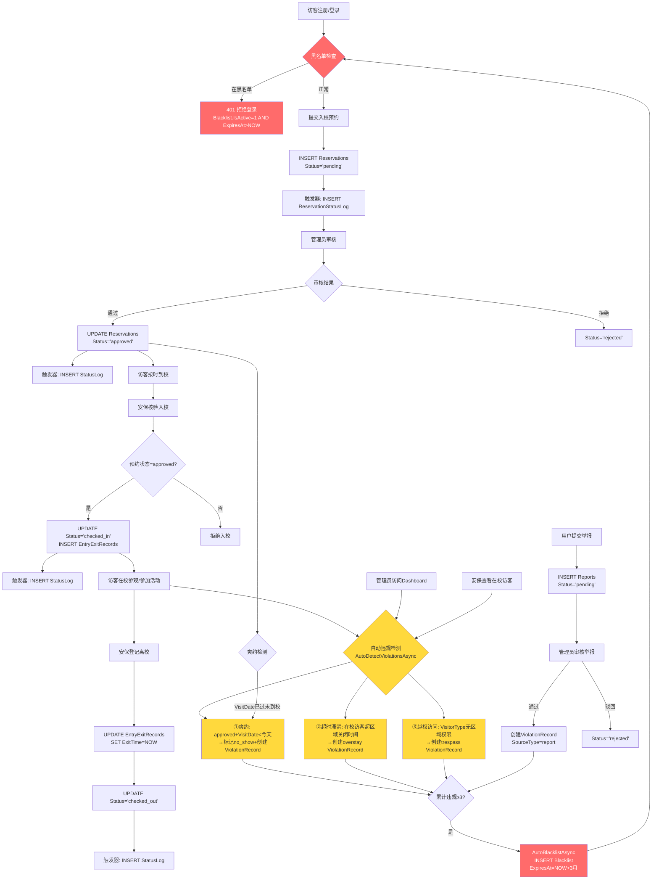
```mermaid
flowchart TD
    A[访客注册/登录] --> B{黑名单检查}
    B -->|在黑名单| B1[401 拒绝登录<br/>Blacklist.IsActive=1 AND ExpiresAt>NOW]
    B -->|正常| C[提交入校预约]
    C --> C1[INSERT Reservations<br/>Status='pending']
    C1 --> C2[触发器: INSERT ReservationStatusLog]
    C2 --> D[管理员审核]
    D --> D1{审核结果}
    D1 -->|通过| D2[UPDATE Reservations<br/>Status='approved']
    D1 -->|拒绝| D3[Status='rejected']
    D2 --> D4[触发器: INSERT StatusLog]
    D2 --> E[访客按时到校]
    E --> F[安保核验入校]
    F --> F1{预约状态=approved?}
    F1 -->|是| F2[UPDATE Status='checked_in'<br/>INSERT EntryExitRecords]
    F1 -->|否| F3[拒绝入校]
    F2 --> F4[触发器: INSERT StatusLog]
    F2 --> G[访客在校参观/参加活动]
  
    G --> H[安保登记离校]
    H --> H1[UPDATE EntryExitRecords<br/>SET ExitTime=NOW]
    H1 --> H2[UPDATE Status='checked_out']
    H2 --> H3[触发器: INSERT StatusLog]
  
    G --> I{自动违规检测<br/>AutoDetectViolationsAsync}
    I --> I1[①爽约: approved+VisitDate<今天<br/>→标记no_show+创建ViolationRecord]
    I --> I2[②超时滞留: 在校访客超区域关闭时间<br/>→创建overstay ViolationRecord]
    I --> I3[③越权访问: VisitorType无区域权限<br/>→创建trespass ViolationRecord]
  
    I1 --> J{累计违规≥3?}
    I2 --> J
    I3 --> J
    J -->|是| J1[AutoBlacklistAsync<br/>INSERT Blacklist<br/>ExpiresAt=NOW+3月]
    J1 --> B
  
    D2 --> K{爽约检测}
    K -->|VisitDate已过未到校| I1
  
    L[用户提交举报] --> L1[INSERT Reports<br/>Status='pending']
    L1 --> M[管理员审核举报]
    M -->|通过| M1[创建ViolationRecord<br/>SourceType=report]
    M1 --> J
    M -->|驳回| M2[Status='rejected']
  
    N[管理员访问Dashboard] --> I
    O[安保查看在校访客] --> I
  
    style B fill:#ff6b6b,color:#fff
    style B1 fill:#ff6b6b,color:#fff
    style J1 fill:#ff6b6b,color:#fff
    style I fill:#ffd93d
    style I1 fill:#ffd93d
    style I2 fill:#ffd93d
    style I3 fill:#ffd93d
```

**业务流程对应数据库表**：

| 流程节点   | 涉及数据库表                                           | 关键操作                                                            |
| ---------- | ------------------------------------------------------ | ------------------------------------------------------------------- |
| 黑名单检查 | `Blacklist`                                          | `SELECT WHERE UserId=? AND IsActive=1 AND ExpiresAt>GETUTCDATE()` |
| 预约提交   | `Reservations` + `ReservationStatusLog`            | INSERT + 触发器自动写日志                                           |
| 预约审核   | `Reservations` + `ReservationStatusLog`            | UPDATE Status + 触发器                                              |
| 入校核验   | `Reservations` + `EntryExitRecords` + `Gates`    | UPDATE + INSERT（同一事务）                                         |
| 离校登记   | `EntryExitRecords` + `Reservations`                | UPDATE ExitTime + UPDATE Status                                     |
| 爽约检测   | `Reservations` + `ViolationRecords`                | 查询过期approved → INSERT违规                                      |
| 超时检测   | `EntryExitRecords` + `OpenRules` + `CampusAreas` | 按区域关闭时间判断滞留                                              |
| 自动拉黑   | `Blacklist`                                          | `INSERT WHERE 累计违规≥3`                                        |
| 举报处理   | `Reports` → `ViolationRecords` → `Blacklist`   | 审核通过→违规记录→拉黑链                                          |

---

## 1.2 组员分工

| 组员             | 学号           | 主要分工               | 具体工作内容                                                                                                                                                                                                                                                                                                                                                                                                                                                                                                                                                                                                                                                                                      |
| ---------------- | -------------- | ---------------------- | ------------------------------------------------------------------------------------------------------------------------------------------------------------------------------------------------------------------------------------------------------------------------------------------------------------------------------------------------------------------------------------------------------------------------------------------------------------------------------------------------------------------------------------------------------------------------------------------------------------------------------------------------------------------------------------------------- |
| **范伟程** | 34520232200939 | 数据库设计与后端开发   | ① 概念结构设计（ER 图绘制，16 表关系建模） ② 逻辑结构设计（数据字典编写，全部字段类型+约束定义） ③ 物理结构设计（13+ 索引、`trg_Reservations_StatusChange` 触发器、`GenerateReservationNo` 函数） ④ SQL 脚本编写（`01-init.sql` 建表、`02-seed-data.sql` 种子数据、`00-full-backup.sql` 一键部署） ⑤ ASP.NET Core 后端框架搭建（Program.cs 依赖注入、JWT 认证中间件、CORS 策略） ⑥ EF Core DbContext 配置（Fluent API 关系映射、16 个 DbSet） ⑦ 核心 Service 开发（`ReservationService`、`EntryExitService`、`AuthService`） ⑧ 自动违规检测与黑名单机制（`AutoDetectViolationsAsync`、`AutoBlacklistAsync`） ⑨ 数据库一致性验证（Sqlcmd 逐表检查种子数据与外键约束） |
| 崔鲡沣           | 34520232200924 | 前端开发与前后端联调   | ① Vue 3 项目搭建（Vite 6 构建、Element Plus 2.9 UI 框架集成） ② 路由与权限控制（Vue Router 4 三套布局 +`beforeEach` 角色守卫 + JWT 动态路由重定向） ③ 状态管理（Pinia 3 `authStore`，Token 持久化，登录/登出逻辑） ④ API 层封装（Axios 1.7 实例，请求拦截器自动注入 Bearer Token，响应拦截器统一 401 处理） ⑤ 访客端页面（预约表单、我的预约、活动浏览与报名、个人中心，共 5 页） ⑥ 管理员端页面（数据看板、预约审核、开放规则、区域管理、活动管理、黑名单+违规记录、排班、审计日志、举报管理，共 11 页） ⑦ 安保端页面（入校核验、离校登记、在校访客、违规举报，共 4 页） ⑧ 前后端联调与数据一致性修复（发现并修正 15 项硬编码数据、API 端点映射错误、字段名不匹配问题）              |
| 韩中信           | 34520232200973 | 后端开发与课程报告撰写 | ①`ActivityService` 开发（活动发布/报名/签到/过期自动关闭） ② `AdminService` 开发（开放规则 CRUD、区域管理、黑名单管理、排班管理、数据看板聚合查询） ③ 举报模块开发（`ReportController` 提交+审核，举报→违规记录→黑名单联动链） ④ DTO 与 AutoMapper 映射配置 ⑤ 课程报告撰写（项目概述、需求分析、技术选型、系统架构、数据库设计说明、成果展示与功能演示、业务链路分析、总结展望） ⑥ 24 张运行截图整理与标注 ⑦ 报告与数据库/代码三层一致性校对（数据字典字段顺序与 SQL DDL 精确对齐）                                                                                                                                                                                                |

---

## 2. 需求分析

### 2.1 用户角色分析

| 角色                          | 职责               | 核心需求                                                                            |
| ----------------------------- | ------------------ | ----------------------------------------------------------------------------------- |
| **校外访客** (visitor)  | 预约入校、报名活动 | 提交预约、查看审核状态、浏览活动、取消预约                                          |
| **管理员** (admin)      | 全局管理与配置     | 审核预约、管理开放规则、管理区域/校门、活动管理、黑名单管理、排班管理、查看数据看板 |
| **安保人员** (security) | 校门核验           | 核验预约信息、登记入校/离校、查看当前在校访客                                       |
| **工作人员** (staff)    | 志愿引导与讲解     | 查看排班、配合活动执行                                                              |

### 2.2 功能需求清单

| 编号   | 功能模块      | 需求描述                                                           | 优先级 |
| ------ | ------------- | ------------------------------------------------------------------ | ------ |
| REQ-01 | 用户注册/登录 | 访客通过手机号注册，所有角色通过手机号+密码登录，系统使用 JWT 认证 | 高     |
| REQ-02 | 入校预约      | 访客选择日期、时段、访客类型，填写个人信息和入校事由，提交预约申请 | 高     |
| REQ-03 | 预约审核      | 管理员查看待审核预约列表，审批通过或拒绝，填写审核意见             | 高     |
| REQ-04 | 入校核验      | 安保人员通过预约编号/手机号/身份证号查询预约，确认后登记入校       | 高     |
| REQ-05 | 离校登记      | 安保人员登记访客离校，记录离校时间和校门                           | 高     |
| REQ-06 | 校园活动管理  | 管理员发布/编辑/删除活动，设置报名上限；访客浏览活动并报名         | 中     |
| REQ-07 | 活动签到      | 管理员为已报名访客进行现场签到                                     | 中     |
| REQ-08 | 开放规则配置  | 管理员设置不同日期类型的开放时段和容量上限                         | 高     |
| REQ-09 | 区域权限管理  | 定义校园区域，配置不同访客类型的可进入权限                         | 中     |
| REQ-10 | 黑名单管理    | 管理员将违规访客加入黑名单，设置拉黑期限                           | 中     |
| REQ-11 | 违规举报      | 用户举报校园内的违规行为，管理员审核处理                           | 低     |
| REQ-12 | 排班管理      | 管理员为安保和工作人员排班                                         | 低     |
| REQ-13 | 数据看板      | 管理员查看今日预约、在校人数、待审核数等统计                       | 中     |
| REQ-14 | 审计日志      | 全量记录所有管理操作，实现全程可追溯                               | 中     |
| REQ-15 | 状态流转追溯  | 记录预约每一次状态变更，从创建到离校全链路可查                     | 高     |

### 2.3 非功能需求

- **安全性**：密码 BCrypt 哈希存储，JWT 令牌认证，基于角色的访问控制（RBAC）
- **数据完整性**：外键约束、CHECK 约束、唯一约束保证数据一致性
- **可追溯性**：预约状态变更触发器自动记录日志，审计日志记录所有后台操作
- **可扩展性**：分层架构（Controller → Service → Repository/EF Core），便于后续扩展

---

## 3. 技术框架选取

### 3.1 技术选型理由

| 层级                  | 技术                  | 具体版本      | 选型理由                                                                                          |
| --------------------- | --------------------- | ------------- | ------------------------------------------------------------------------------------------------- |
| **数据库**      | SQL Server            | 2019          | 课程要求使用关系型数据库，SQL Server 提供完善的约束、触发器、存储过程支持，适合展示数据库设计能力 |
| **后端框架**    | ASP.NET Core Web API  | .NET 8.0.11   | 微软官方框架，内置依赖注入、JWT 认证中间件，Entity Framework Core 作为 ORM 实现代码优先开发       |
| **ORM**         | Entity Framework Core | 8.0.11        | 与 .NET 深度集成，支持 Fluent API 配置关系映射，自动迁移，LINQ 查询语法简洁                       |
| **认证**        | JWT Bearer            | 8.0.11        | `Microsoft.AspNetCore.Authentication.JwtBearer`，无状态认证方案，适合前后端分离架构             |
| **密码加密**    | BCrypt.Net-Next       | 4.0.3         | 自动加盐哈希，防止彩虹表攻击，`HashPassword("123456")` 产生 `$2a$11$...` 格式的 60 字符密文   |
| **对象映射**    | AutoMapper            | 12.0.1        | `AutoMapper.Extensions.Microsoft.DependencyInjection`，Entity ↔ DTO 自动映射，减少样板代码     |
| **前端框架**    | Vue 3                 | 3.5.13        | 渐进式框架，组合式 API（Composition API），`<script setup>` 语法糖                              |
| **UI 组件库**   | Element Plus          | 2.9.0         | 成熟的 Vue 3 组件库，提供丰富的表单、表格、对话框等组件，适合后台管理系统                         |
| **状态管理**    | Pinia                 | 3.0.0         | Vue 官方推荐的状态管理库，`defineStore` 定义 auth store，存储 Token + 用户信息                  |
| **路由**        | Vue Router            | 4.5.0         | Vue 官方路由，支持嵌套路由和`beforeEach` 路由守卫，实现基于角色的页面访问控制                   |
| **构建工具**    | Vite                  | 6.1.0         | 新一代前端构建工具，开发服务器秒级启动，HMR 热更新，`@vitejs/plugin-vue` 5.2.0                  |
| **HTTP 客户端** | Axios                 | 1.7.0         | 基于 Promise 的 HTTP 库，请求拦截器自动附加`Bearer Token`，响应拦截器统一处理 401               |
| **图表库**      | ECharts + Vue-ECharts | 5.6.0 / 7.0.3 | 数据看板图表预留集成                                                                              |
| **日期处理**    | Day.js                | 1.11.13       | 轻量级日期库，前端格式化入校/离校时间                                                             |

### 3.2 架构选型理由

采用**前后端分离**架构的核心考量：

1. **开发解耦**：前端和后端可以独立开发和调试，互不阻塞
2. **多端复用**：后端 API 可同时服务 Web 端、移动端等不同前端
3. **职责清晰**：后端专注业务逻辑和数据访问，前端专注用户交互和界面展示
4. **符合行业趋势**：前后端分离是当前 Web 开发的主流模式

---

## 4. 系统架构设计

### 4.1 总体架构

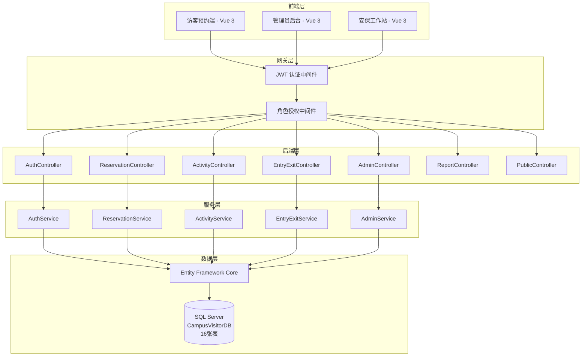
```mermaid
graph TD
    subgraph 前端层
        A1[访客预约端 - Vue 3]
        A2[管理员后台 - Vue 3]
        A3[安保工作站 - Vue 3]
    end

    subgraph 网关层
        B[JWT 认证中间件]
        C[角色授权中间件]
    end

    subgraph 后端层
        D1[AuthController]
        D2[ReservationController]
        D3[ActivityController]
        D4[EntryExitController]
        D5[AdminController]
        D6[ReportController]
        D7[PublicController]
    end

    subgraph 服务层
        E1[AuthService]
        E2[ReservationService]
        E3[ActivityService]
        E4[EntryExitService]
        E5[AdminService]
    end

    subgraph 数据层
        F1[(SQL Server<br/>CampusVisitorDB<br/>16张表)]
        F2[Entity Framework Core]
    end

    A1 --> B
    A2 --> B
    A3 --> B
    B --> C
    C --> D1
    C --> D2
    C --> D3
    C --> D4
    C --> D5
    C --> D6
    C --> D7
    D1 --> E1
    D2 --> E2
    D3 --> E3
    D4 --> E4
    D5 --> E5
    E1 --> F2
    E2 --> F2
    E3 --> F2
    E4 --> F2
    E5 --> F2
    F2 --> F1
```

### 4.2 分层职责

| 层级                 | 职责                                                   | 实现方式                                            |
| -------------------- | ------------------------------------------------------ | --------------------------------------------------- |
| **Controller** | 接收 HTTP 请求，参数校验，调用 Service，返回 HTTP 响应 | ASP.NET Core Controller +`[ApiController]` 特性   |
| **Service**    | 核心业务逻辑，事务管理，调用 EF Core 进行数据操作      | 接口+实现分离（`IAuthService` / `AuthService`） |
| **DbContext**  | 数据库上下文，定义实体映射关系，管理数据库连接         | `CampusVisitorDbContext : DbContext`              |
| **Model**      | 数据库实体映射，定义表结构、字段约束、导航属性         | C# POCO 类 + Data Annotations + Fluent API          |

---

## 5. 数据库设计

> **数据库名称**：`CampusVisitorDB`
> **数据库引擎**：SQL Server 2019
> **总表数量**：16 张
> **设计原则**：第三范式（3NF），合理的冗余以优化查询性能

### 5.1 概念结构设计（ER 图）

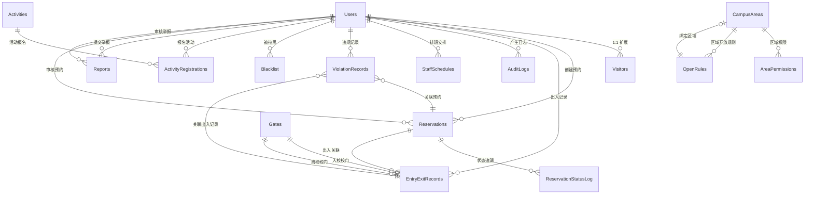
```mermaid
erDiagram
    Users ||--o{ Visitors : "1:1 扩展"
    Users ||--o{ Reservations : "创建预约"
    Users ||--o{ EntryExitRecords : "出入记录"
    Users ||--o{ AuditLogs : "产生日志"
    Users ||--o{ StaffSchedules : "排班安排"
    Users ||--o{ ViolationRecords : "违规记录"
    Users ||--o{ Blacklist : "被拉黑"
    Users ||--o{ ActivityRegistrations : "报名活动"
    Users ||--o{ Reports : "提交举报"

    Reservations ||--o{ ReservationStatusLog : "状态追溯"
    Reservations ||--o{ EntryExitRecords : "出入关联"

    CampusAreas ||--o{ AreaPermissions : "区域权限"
    CampusAreas ||--o{ OpenRules : "区域开放规则"

    Activities ||--o{ ActivityRegistrations : "活动报名"

    Gates ||--o{ EntryExitRecords : "入校校门"
    Gates ||--o{ EntryExitRecords : "离校校门"

    Users ||--o{ Reservations : "审核预约"
    Users ||--o{ Reports : "审核举报"
  
    OpenRules ||--o| CampusAreas : "绑定区域"
    ViolationRecords }o--|| Reservations : "关联预约"
    ViolationRecords }o--|| EntryExitRecords : "关联出入记录"
```

**ER 图说明**：

- `Users` 是系统的**中心实体**，统一管理所有角色（访客、管理员、安保、工作人员），通过 `Role` 字段区分
- `Visitors` 是 `Users` 的 **1:1 扩展表**，存放访客特有信息（身份证号、访客类型等）
- `Reservations` 是**核心业务表**，承载预约申请、审核、入校、离校全流程
- `ReservationStatusLog` 是**审计关联表**，通过触发器自动记录每一次状态变更
- `CampusAreas` 和 `AreaPermissions` 构成**多对多关系**，实现不同访客类型对不同区域的差异化访问权限
- `OpenRules` 通过 `AreaId` 外键关联到 `CampusAreas`，实现**区域级差异化开放规则配置**，NULL 表示全校通用规则
- `EntryExitRecords` 同时关联 `Reservations`、`Users`、`Gates`（入口/出口），形成完整的出入轨迹
- `ViolationRecords` 通过 `SourceId` 关联至预约表或出入记录表，实现**违规溯源**

### 5.2 逻辑结构设计（数据字典）

以下是全部 16 张表的数据字典：

#### 5.2.1 Users（用户表）— 统一身份管理

| 字段名           | 数据类型     | 约束                                                                              | 说明               |
| ---------------- | ------------ | --------------------------------------------------------------------------------- | ------------------ |
| `Id`           | INT          | **PK**, IDENTITY(1,1)                                                       | 用户唯一标识       |
| `Name`         | NVARCHAR(50) | NOT NULL                                                                          | 用户姓名           |
| `Phone`        | VARCHAR(20)  | NOT NULL,**UNIQUE**                                                         | 手机号（登录账号） |
| `PasswordHash` | VARCHAR(256) | NOT NULL                                                                          | BCrypt 密码哈希    |
| `Role`         | VARCHAR(20)  | NOT NULL, DEFAULT 'visitor',**CHECK**('visitor','admin','security','staff') | 用户角色           |
| `Email`        | VARCHAR(100) | NULL                                                                              | 邮箱               |
| `IsActive`     | BIT          | NOT NULL, DEFAULT 1                                                               | 账户是否激活       |
| `CreatedAt`    | DATETIME2    | NOT NULL, DEFAULT GETDATE()                                                       | 注册时间           |
| `UpdatedAt`    | DATETIME2    | NOT NULL, DEFAULT GETDATE()                                                       | 更新时间           |
| `LastLoginAt`  | DATETIME2    | NULL                                                                              | 最后登录时间       |

> **SQL 建表语句**（`01-init.sql`）：
>
> ```sql
> CREATE TABLE [dbo].[Users] (
>     [Id]            INT IDENTITY(1,1) PRIMARY KEY,
>     [Name]          NVARCHAR(50)    NOT NULL,
>     [Phone]         VARCHAR(20)     NOT NULL,
>     [PasswordHash]  VARCHAR(256)    NOT NULL,
>     [Role]          VARCHAR(20)     NOT NULL DEFAULT 'visitor'
>         CHECK ([Role] IN ('visitor','admin','security','staff')),
>     [Email]         VARCHAR(100)    NULL,
>     [IsActive]      BIT             NOT NULL DEFAULT 1,
>     [CreatedAt]     DATETIME2       NOT NULL DEFAULT GETDATE(),
>     [UpdatedAt]     DATETIME2       NOT NULL DEFAULT GETDATE(),
>     [LastLoginAt]   DATETIME2       NULL,
>     CONSTRAINT [UQ_Users_Phone] UNIQUE ([Phone])
> )
> ```

#### 5.2.2 Visitors（访客信息扩展表）

| 字段名               | 数据类型      | 约束                                                                                             | 说明         |
| -------------------- | ------------- | ------------------------------------------------------------------------------------------------ | ------------ |
| `Id`               | INT           | **PK**, IDENTITY(1,1)                                                                      | 记录ID       |
| `UserId`           | INT           | NOT NULL,**FK** → Users(Id)                                                               | 关联用户     |
| `IdCard`           | VARCHAR(20)   | NULL                                                                                             | 身份证号     |
| `Gender`           | VARCHAR(4)    | NULL,**CHECK**('男','女','其他')                                                           | 性别         |
| `BirthDate`        | DATE          | NULL                                                                                             | 出生日期     |
| `Affiliation`      | NVARCHAR(100) | NULL                                                                                             | 所属单位     |
| `VisitorType`      | VARCHAR(20)   | NOT NULL, DEFAULT 'tourist',**CHECK**('parent','alumni','tourist','study_group','partner') | 访客类型     |
| `EmergencyContact` | NVARCHAR(50)  | NULL                                                                                             | 紧急联系人   |
| `EmergencyPhone`   | VARCHAR(20)   | NULL                                                                                             | 紧急联系电话 |
| `Remarks`          | NVARCHAR(500) | NULL                                                                                             | 备注         |

> **SQL 建表语句**（`01-init.sql`）：
>
> ```sql
> CREATE TABLE [dbo].[Visitors] (
>     [Id]               INT IDENTITY(1,1) PRIMARY KEY,
>     [UserId]           INT             NOT NULL,
>     [IdCard]           VARCHAR(20)     NULL,
>     [Gender]           VARCHAR(4)      NULL CHECK ([Gender] IN ('男','女','其他')),
>     [BirthDate]        DATE            NULL,
>     [Affiliation]      NVARCHAR(100)   NULL,
>     [VisitorType]      VARCHAR(20)     NOT NULL DEFAULT 'tourist'
>         CHECK ([VisitorType] IN ('parent','alumni','tourist','study_group','partner')),
>     [EmergencyContact] NVARCHAR(50)    NULL,
>     [EmergencyPhone]   VARCHAR(20)     NULL,
>     [Remarks]          NVARCHAR(500)   NULL,
>     CONSTRAINT [FK_Visitors_Users] FOREIGN KEY ([UserId]) REFERENCES [dbo].[Users]([Id])
> )
> ```

#### 5.2.3 Reservations（预约申请表）— 核心表

| 字段名            | 数据类型      | 约束                                                                                                                          | 说明                                 |
| ----------------- | ------------- | ----------------------------------------------------------------------------------------------------------------------------- | ------------------------------------ |
| `Id`            | INT           | **PK**, IDENTITY(1,1)                                                                                                   | 预约ID                               |
| `UserId`        | INT           | NOT NULL,**FK** → Users(Id)                                                                                            | 预约用户                             |
| `ReservationNo` | VARCHAR(30)   | NOT NULL,**UNIQUE**                                                                                                     | 预约编号（格式：R+yyyyMMdd+4位序号） |
| `VisitorType`   | VARCHAR(20)   | NOT NULL,**CHECK**('parent','alumni','tourist','study_group','partner')                                                 | 访客类型                             |
| `VisitorName`   | NVARCHAR(50)  | NOT NULL                                                                                                                      | 访客姓名                             |
| `VisitorPhone`  | VARCHAR(20)   | NOT NULL                                                                                                                      | 访客手机号                           |
| `VisitDate`     | DATE          | NOT NULL                                                                                                                      | 参观日期                             |
| `TimeSlot`      | VARCHAR(20)   | NOT NULL,**CHECK**('morning','afternoon','full_day')                                                                    | 预约时段                             |
| `Companions`    | INT           | NOT NULL, DEFAULT 0                                                                                                           | 同行人数                             |
| `StayDuration`  | VARCHAR(20)   | NULL                                                                                                                          | 预计停留时长                         |
| `Purpose`       | NVARCHAR(500) | NOT NULL                                                                                                                      | 入校事由                             |
| `Status`        | VARCHAR(20)   | NOT NULL, DEFAULT 'pending',**CHECK**('pending','approved','rejected','cancelled','checked_in','checked_out','no_show') | 预约状态                             |
| `ReviewerId`    | INT           | NULL,**FK** → Users(Id)                                                                                                | 审核人ID                             |
| `ReviewRemark`  | NVARCHAR(500) | NULL                                                                                                                          | 审核备注                             |
| `ReviewedAt`    | DATETIME2     | NULL                                                                                                                          | 审核时间                             |
| `CreatedAt`     | DATETIME2     | NOT NULL, DEFAULT GETDATE()                                                                                                   | 创建时间                             |
| `UpdatedAt`     | DATETIME2     | NOT NULL, DEFAULT GETDATE()                                                                                                   | 更新时间                             |

> **SQL 建表语句**（`01-init.sql`）：
>
> ```sql
> CREATE TABLE [dbo].[Reservations] (
>     [Id]            INT IDENTITY(1,1) PRIMARY KEY,
>     [UserId]        INT             NOT NULL,
>     [ReservationNo] VARCHAR(30)     NOT NULL,
>     [VisitorType]   VARCHAR(20)     NOT NULL
>         CHECK ([VisitorType] IN ('parent','alumni','tourist','study_group','partner')),
>     [VisitorName]   NVARCHAR(50)    NOT NULL,
>     [VisitorPhone]  VARCHAR(20)     NOT NULL,
>     [VisitDate]     DATE            NOT NULL,
>     [TimeSlot]      VARCHAR(20)     NOT NULL
>         CHECK ([TimeSlot] IN ('morning','afternoon','full_day')),
>     [Companions]    INT             NOT NULL DEFAULT 0,
>     [StayDuration]  VARCHAR(20)     NULL,
>     [Purpose]       NVARCHAR(500)   NOT NULL,
>     [Status]        VARCHAR(20)     NOT NULL DEFAULT 'pending'
>         CHECK ([Status] IN ('pending','approved','rejected','cancelled','checked_in','checked_out','no_show')),
>     [ReviewerId]    INT             NULL,
>     [ReviewRemark]  NVARCHAR(500)   NULL,
>     [ReviewedAt]    DATETIME2       NULL,
>     [CreatedAt]     DATETIME2       NOT NULL DEFAULT GETDATE(),
>     [UpdatedAt]     DATETIME2       NOT NULL DEFAULT GETDATE(),
>     CONSTRAINT [UQ_Reservations_No] UNIQUE ([ReservationNo]),
>     CONSTRAINT [FK_Res_User] FOREIGN KEY ([UserId]) REFERENCES [dbo].[Users]([Id]),
>     CONSTRAINT [FK_Res_Reviewer] FOREIGN KEY ([ReviewerId]) REFERENCES [dbo].[Users]([Id])
> )
> ```

**状态流转逻辑**：

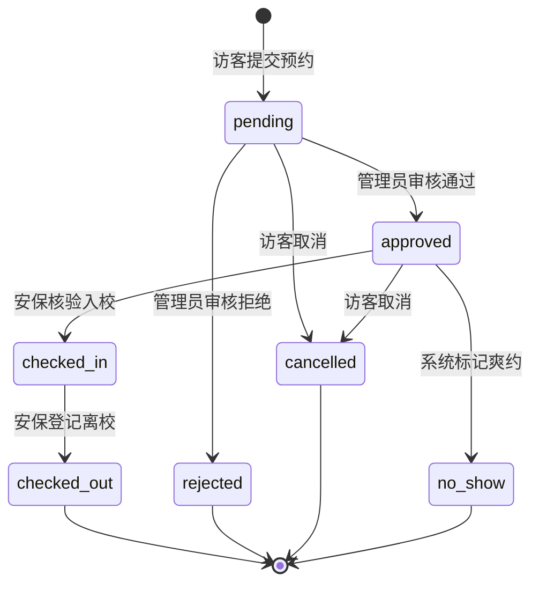
```mermaid
stateDiagram-v2
    [*] --> pending : 访客提交预约
    pending --> approved : 管理员审核通过
    pending --> rejected : 管理员审核拒绝
    pending --> cancelled : 访客取消
    approved --> checked_in : 安保核验入校
    approved --> cancelled : 访客取消
    approved --> no_show : 系统标记爽约
    checked_in --> checked_out : 安保登记离校
    checked_out --> [*]
    rejected --> [*]
    cancelled --> [*]
    no_show --> [*]
```

#### 5.2.4 ReservationStatusLog（预约状态变更日志表）

| 字段名            | 数据类型      | 约束                                      | 说明       |
| ----------------- | ------------- | ----------------------------------------- | ---------- |
| `Id`            | INT           | **PK**, IDENTITY(1,1)               | 日志ID     |
| `ReservationId` | INT           | NOT NULL,**FK** → Reservations(Id) | 关联预约   |
| `FromStatus`    | VARCHAR(20)   | NULL                                      | 变更前状态 |
| `ToStatus`      | VARCHAR(20)   | NOT NULL                                  | 变更后状态 |
| `OperatorId`    | INT           | NULL,**FK** → Users(Id)            | 操作人     |
| `Remark`        | NVARCHAR(500) | NULL                                      | 备注说明   |
| `CreatedAt`     | DATETIME2     | NOT NULL, DEFAULT GETDATE()               | 记录时间   |

> **SQL 建表语句**（`01-init.sql`）：
>
> ```sql
> CREATE TABLE [dbo].[ReservationStatusLog] (
>     [Id]            INT IDENTITY(1,1) PRIMARY KEY,
>     [ReservationId] INT             NOT NULL,
>     [FromStatus]    VARCHAR(20)     NULL,
>     [ToStatus]      VARCHAR(20)     NOT NULL,
>     [OperatorId]    INT             NULL,
>     [Remark]        NVARCHAR(500)   NULL,
>     [CreatedAt]     DATETIME2       NOT NULL DEFAULT GETDATE(),
>     CONSTRAINT [FK_RSL_Reservation] FOREIGN KEY ([ReservationId]) REFERENCES [dbo].[Reservations]([Id]),
>     CONSTRAINT [FK_RSL_Operator] FOREIGN KEY ([OperatorId]) REFERENCES [dbo].[Users]([Id])
> )
> ```

#### 5.2.5 CampusAreas（校园区域表）

| 字段名             | 数据类型      | 约束                                                                                                 | 说明             |
| ------------------ | ------------- | ---------------------------------------------------------------------------------------------------- | ---------------- |
| `Id`             | INT           | **PK**                                                                                         | 区域ID           |
| `Name`           | NVARCHAR(100) | NOT NULL                                                                                             | 区域名称         |
| `Code`           | VARCHAR(20)   | NOT NULL,**UNIQUE**                                                                            | 区域编码         |
| `Type`           | VARCHAR(20)   | NOT NULL, DEFAULT 'public',**CHECK**('public','academic','office','living','lab','restricted') | 区域类型         |
| `AccessLevel`    | VARCHAR(20)   | NOT NULL, DEFAULT 'public',**CHECK**('public','restricted','forbidden')                        | 开放等级         |
| `Description`    | NVARCHAR(500) | NULL                                                                                                 | 区域描述         |
| `MorningStart`   | TIME          | NULL                                                                                                 | 默认上午开放时间 |
| `MorningEnd`     | TIME          | NULL                                                                                                 | 默认上午关闭时间 |
| `AfternoonStart` | TIME          | NULL                                                                                                 | 默认下午开放时间 |
| `AfternoonEnd`   | TIME          | NULL                                                                                                 | 默认下午关闭时间 |
| `IsActive`       | BIT           | NOT NULL, DEFAULT 1                                                                                  | 是否启用         |
| `CreatedAt`      | DATETIME2     | NOT NULL, DEFAULT GETDATE()                                                                          | 创建时间         |

> **SQL 建表语句**（`01-init.sql`）：
>
> ```sql
> CREATE TABLE [dbo].[CampusAreas] (
>     [Id]            INT IDENTITY(1,1) PRIMARY KEY,
>     [Name]          NVARCHAR(100)   NOT NULL,
>     [Code]          VARCHAR(20)     NOT NULL,
>     [Type]          VARCHAR(20)     NOT NULL DEFAULT 'public'
>         CHECK ([Type] IN ('public','academic','office','living','lab','restricted')),
>     [AccessLevel]   VARCHAR(20)     NOT NULL DEFAULT 'public'
>         CHECK ([AccessLevel] IN ('public','restricted','forbidden')),
>     [Description]   NVARCHAR(500)   NULL,
>     [MorningStart]  TIME            NULL,
>     [MorningEnd]    TIME            NULL,
>     [AfternoonStart] TIME           NULL,
>     [AfternoonEnd]  TIME            NULL,
>     [IsActive]      BIT             NOT NULL DEFAULT 1,
>     [CreatedAt]     DATETIME2       NOT NULL DEFAULT GETDATE(),
>     CONSTRAINT [UQ_CampusAreas_Code] UNIQUE ([Code])
> )
> ```

#### 5.2.6 AreaPermissions（区域权限表）

| 字段名          | 数据类型    | 约束                                                                          | 说明           |
| --------------- | ----------- | ----------------------------------------------------------------------------- | -------------- |
| `Id`          | INT         | **PK**                                                                  | 权限ID         |
| `AreaId`      | INT         | NOT NULL,**FK** → CampusAreas(Id) ON DELETE CASCADE                    | 区域ID         |
| `VisitorType` | VARCHAR(20) | NOT NULL,**CHECK**('parent','alumni','tourist','study_group','partner') | 允许的访客类型 |
| —              | —          | **UNIQUE**(AreaId, VisitorType)                                         | 复合唯一约束   |

> **SQL 建表语句**（`01-init.sql`）：
>
> ```sql
> CREATE TABLE [dbo].[AreaPermissions] (
>     [Id]          INT IDENTITY(1,1) PRIMARY KEY,
>     [AreaId]      INT            NOT NULL,
>     [VisitorType] VARCHAR(20)    NOT NULL
>         CHECK ([VisitorType] IN ('parent','alumni','tourist','study_group','partner')),
>     CONSTRAINT [FK_AP_Areas] FOREIGN KEY ([AreaId]) REFERENCES [dbo].[CampusAreas]([Id]) ON DELETE CASCADE,
>     CONSTRAINT [UQ_AP_AreaType] UNIQUE ([AreaId],[VisitorType])
> )
> ```

#### 5.2.7 Gates（校门表）

| 字段名       | 数据类型     | 约束                      | 说明     |
| ------------ | ------------ | ------------------------- | -------- |
| `Id`       | INT          | **PK**              | 校门ID   |
| `Name`     | NVARCHAR(50) | NOT NULL                  | 校门名称 |
| `Code`     | VARCHAR(20)  | NOT NULL,**UNIQUE** | 校门编码 |
| `IsActive` | BIT          | NOT NULL, DEFAULT 1       | 是否启用 |

> **SQL 建表语句**（`01-init.sql`）：
>
> ```sql
> CREATE TABLE [dbo].[Gates] (
>     [Id]       INT IDENTITY(1,1) PRIMARY KEY,
>     [Name]     NVARCHAR(50)    NOT NULL,
>     [Code]     VARCHAR(20)     NOT NULL,
>     [IsActive] BIT             NOT NULL DEFAULT 1,
>     CONSTRAINT [UQ_Gates_Code] UNIQUE ([Code])
> )
> ```

#### 5.2.8 OpenRules（开放规则表）

| 字段名             | 数据类型      | 约束                                                                    | 说明                      |
| ------------------ | ------------- | ----------------------------------------------------------------------- | ------------------------- |
| `Id`             | INT           | **PK**                                                            | 规则ID                    |
| `AreaId`         | INT           | NULL,**FK** → CampusAreas(Id) ON DELETE SET NULL                 | 关联区域（NULL=全校通用） |
| `DateType`       | VARCHAR(20)   | NOT NULL,**CHECK**('weekday','weekend','holiday','exam','custom') | 日期类型                  |
| `StartDate`      | DATE          | NOT NULL                                                                | 开始日期                  |
| `EndDate`        | DATE          | NOT NULL                                                                | 结束日期                  |
| `TimeSlot`       | VARCHAR(20)   | NOT NULL,**CHECK**('morning','afternoon','full_day')              | 开放时段                  |
| `MorningStart`   | TIME          | NULL, DEFAULT '08:00'                                                   | 上午开始                  |
| `MorningEnd`     | TIME          | NULL, DEFAULT '12:00'                                                   | 上午结束                  |
| `AfternoonStart` | TIME          | NULL, DEFAULT '12:00'                                                   | 下午开始                  |
| `AfternoonEnd`   | TIME          | NULL, DEFAULT '17:00'                                                   | 下午结束（用于违规检测）  |
| `MaxCapacity`    | INT           | NOT NULL, DEFAULT 500                                                   | 最大接待人数              |
| `IsActive`       | BIT           | NOT NULL, DEFAULT 1                                                     | 是否启用                  |
| `Remark`         | NVARCHAR(500) | NULL                                                                    | 备注                      |
| `CreatedAt`      | DATETIME2     | NOT NULL, DEFAULT GETDATE()                                             | 创建时间                  |
| `UpdatedAt`      | DATETIME2     | NOT NULL, DEFAULT GETDATE()                                             | 更新时间                  |

> **SQL 建表语句**（`01-init.sql`）：
>
> ```sql
> CREATE TABLE [dbo].[OpenRules] (
>     [Id]             INT IDENTITY(1,1) PRIMARY KEY,
>     [AreaId]         INT             NULL,
>     [DateType]       VARCHAR(20)     NOT NULL
>         CHECK ([DateType] IN ('weekday','weekend','holiday','exam','custom')),
>     [StartDate]      DATE            NOT NULL,
>     [EndDate]        DATE            NOT NULL,
>     [TimeSlot]       VARCHAR(20)     NOT NULL
>         CHECK ([TimeSlot] IN ('morning','afternoon','full_day')),
>     [MorningStart]   TIME            NULL DEFAULT '08:00',
>     [MorningEnd]     TIME            NULL DEFAULT '12:00',
>     [AfternoonStart] TIME            NULL DEFAULT '12:00',
>     [AfternoonEnd]   TIME            NULL DEFAULT '17:00',
>     [MaxCapacity]    INT             NOT NULL DEFAULT 500,
>     [IsActive]       BIT             NOT NULL DEFAULT 1,
>     [Remark]         NVARCHAR(500)   NULL,
>     [CreatedAt]      DATETIME2       NOT NULL DEFAULT GETDATE(),
>     [UpdatedAt]      DATETIME2       NOT NULL DEFAULT GETDATE(),
>     CONSTRAINT [FK_OpenRules_Areas] FOREIGN KEY ([AreaId]) REFERENCES [dbo].[CampusAreas]([Id]) ON DELETE SET NULL
> )
> ```

#### 5.2.9 Activities（活动表）

| 字段名              | 数据类型       | 约束                                                                           | 说明       |
| ------------------- | -------------- | ------------------------------------------------------------------------------ | ---------- |
| `Id`              | INT            | **PK**                                                                   | 活动ID     |
| `Title`           | NVARCHAR(200)  | NOT NULL                                                                       | 活动标题   |
| `Location`        | NVARCHAR(200)  | NOT NULL                                                                       | 活动地点   |
| `Description`     | NVARCHAR(2000) | NULL                                                                           | 活动描述   |
| `StartTime`       | DATETIME2      | NOT NULL                                                                       | 开始时间   |
| `EndTime`         | DATETIME2      | NOT NULL                                                                       | 结束时间   |
| `MaxParticipants` | INT            | NOT NULL, DEFAULT 100                                                          | 人数上限   |
| `CurrentCount`    | INT            | NOT NULL, DEFAULT 0                                                            | 当前报名数 |
| `Status`          | VARCHAR(20)    | NOT NULL, DEFAULT 'draft',**CHECK**('draft','open','closed','cancelled') | 活动状态   |
| `CoverImage`      | VARCHAR(500)   | NULL                                                                           | 封面图URL  |
| `ContactPerson`   | NVARCHAR(50)   | NULL                                                                           | 联系人     |
| `ContactPhone`    | VARCHAR(20)    | NULL                                                                           | 联系电话   |
| `CreatedBy`       | INT            | NOT NULL,**FK** → Users(Id)                                             | 创建人     |
| `CreatedAt`       | DATETIME2      | NOT NULL, DEFAULT GETDATE()                                                    | 创建时间   |
| `UpdatedAt`       | DATETIME2      | NOT NULL, DEFAULT GETDATE()                                                    | 更新时间   |

> **SQL 建表语句**（`01-init.sql`）：
>
> ```sql
> CREATE TABLE [dbo].[Activities] (
>     [Id]              INT IDENTITY(1,1) PRIMARY KEY,
>     [Title]           NVARCHAR(200)  NOT NULL,
>     [Location]        NVARCHAR(200)  NOT NULL,
>     [Description]     NVARCHAR(2000) NULL,
>     [StartTime]       DATETIME2      NOT NULL,
>     [EndTime]         DATETIME2      NOT NULL,
>     [MaxParticipants] INT            NOT NULL DEFAULT 100,
>     [CurrentCount]    INT            NOT NULL DEFAULT 0,
>     [Status]          VARCHAR(20)    NOT NULL DEFAULT 'draft'
>         CHECK ([Status] IN ('draft','open','closed','cancelled')),
>     [CoverImage]      VARCHAR(500)   NULL,
>     [ContactPerson]   NVARCHAR(50)   NULL,
>     [ContactPhone]    VARCHAR(20)    NULL,
>     [CreatedBy]       INT            NOT NULL,
>     [CreatedAt]       DATETIME2      NOT NULL DEFAULT GETDATE(),
>     [UpdatedAt]       DATETIME2      NOT NULL DEFAULT GETDATE(),
>     CONSTRAINT [FK_Activities_Users] FOREIGN KEY ([CreatedBy]) REFERENCES [dbo].[Users]([Id])
> )
> ```

#### 5.2.10 ActivityRegistrations（活动报名表）

| 字段名           | 数据类型     | 约束                                                                                           | 说明                     |
| ---------------- | ------------ | ---------------------------------------------------------------------------------------------- | ------------------------ |
| `Id`           | INT          | **PK**                                                                                   | 报名ID                   |
| `ActivityId`   | INT          | NOT NULL,**FK** → Activities(Id)                                                        | 活动ID                   |
| `UserId`       | INT          | NOT NULL,**FK** → Users(Id)                                                             | 用户ID                   |
| `VisitorName`  | NVARCHAR(50) | NOT NULL                                                                                       | 报名人姓名               |
| `VisitorPhone` | VARCHAR(20)  | NOT NULL                                                                                       | 报名人手机号             |
| `Companions`   | INT          | NOT NULL, DEFAULT 0                                                                            | 同行人数                 |
| `Status`       | VARCHAR(20)  | NOT NULL, DEFAULT 'registered',**CHECK**('registered','cancelled','checked_in','absent') | 报名状态                 |
| `CheckedInAt`  | DATETIME2    | NULL                                                                                           | 签到时间                 |
| `CreatedAt`    | DATETIME2    | NOT NULL, DEFAULT GETDATE()                                                                    | 报名时间                 |
| —               | —           | **UNIQUE**(ActivityId, UserId)                                                           | 一人对一活动只能报名一次 |

> **SQL 建表语句**（`01-init.sql`）：
>
> ```sql
> CREATE TABLE [dbo].[ActivityRegistrations] (
>     [Id]           INT IDENTITY(1,1) PRIMARY KEY,
>     [ActivityId]   INT            NOT NULL,
>     [UserId]       INT            NOT NULL,
>     [VisitorName]  NVARCHAR(50)   NOT NULL,
>     [VisitorPhone] VARCHAR(20)    NOT NULL,
>     [Companions]   INT            NOT NULL DEFAULT 0,
>     [Status]       VARCHAR(20)    NOT NULL DEFAULT 'registered'
>         CHECK ([Status] IN ('registered','cancelled','checked_in','absent')),
>     [CheckedInAt]  DATETIME2      NULL,
>     [CreatedAt]    DATETIME2      NOT NULL DEFAULT GETDATE(),
>     CONSTRAINT [FK_AR_Activity] FOREIGN KEY ([ActivityId]) REFERENCES [dbo].[Activities]([Id]),
>     CONSTRAINT [FK_AR_User] FOREIGN KEY ([UserId]) REFERENCES [dbo].[Users]([Id]),
>     CONSTRAINT [UQ_AR_ActivityUser] UNIQUE ([ActivityId], [UserId])
> )
> ```

#### 5.2.11 EntryExitRecords（出入校记录表）

| 字段名            | 数据类型  | 约束                                      | 说明       |
| ----------------- | --------- | ----------------------------------------- | ---------- |
| `Id`            | INT       | **PK**                              | 记录ID     |
| `ReservationId` | INT       | NOT NULL,**FK** → Reservations(Id) | 关联预约   |
| `UserId`        | INT       | NOT NULL,**FK** → Users(Id)        | 用户ID     |
| `EntryTime`     | DATETIME2 | NULL                                      | 入校时间   |
| `EntryGateId`   | INT       | NULL,**FK** → Gates(Id)            | 入校校门   |
| `ExitTime`      | DATETIME2 | NULL                                      | 离校时间   |
| `ExitGateId`    | INT       | NULL,**FK** → Gates(Id)            | 离校校门   |
| `OperatorId`    | INT       | NULL,**FK** → Users(Id)            | 核验操作人 |
| `CreatedAt`     | DATETIME2 | NOT NULL, DEFAULT GETDATE()               | 记录时间   |

> **SQL 建表语句**（`01-init.sql`）：
>
> ```sql
> CREATE TABLE [dbo].[EntryExitRecords] (
>     [Id]            INT IDENTITY(1,1) PRIMARY KEY,
>     [ReservationId] INT            NOT NULL,
>     [UserId]        INT            NOT NULL,
>     [EntryTime]     DATETIME2      NULL,
>     [EntryGateId]   INT            NULL,
>     [ExitTime]      DATETIME2      NULL,
>     [ExitGateId]    INT            NULL,
>     [OperatorId]    INT            NULL,
>     [CreatedAt]     DATETIME2      NOT NULL DEFAULT GETDATE(),
>     CONSTRAINT [FK_EER_Reservation] FOREIGN KEY ([ReservationId]) REFERENCES [dbo].[Reservations]([Id]),
>     CONSTRAINT [FK_EER_User] FOREIGN KEY ([UserId]) REFERENCES [dbo].[Users]([Id]),
>     CONSTRAINT [FK_EER_EntryGate] FOREIGN KEY ([EntryGateId]) REFERENCES [dbo].[Gates]([Id]),
>     CONSTRAINT [FK_EER_ExitGate] FOREIGN KEY ([ExitGateId]) REFERENCES [dbo].[Gates]([Id]),
>     CONSTRAINT [FK_EER_Operator] FOREIGN KEY ([OperatorId]) REFERENCES [dbo].[Users]([Id])
> )
> ```

#### 5.2.12 ViolationRecords（违规记录表）

| 字段名            | 数据类型       | 约束                                                                                                           | 说明                            |
| ----------------- | -------------- | -------------------------------------------------------------------------------------------------------------- | ------------------------------- |
| `Id`            | INT            | **PK**                                                                                                   | 记录ID                          |
| `UserId`        | INT            | NOT NULL,**FK** → Users(Id)                                                                             | 违规用户                        |
| `ViolationType` | VARCHAR(20)    | NOT NULL,**CHECK**('no_show','overstay','trespass','duplicate','absence','disturbance','damage','other') | 违规类型                        |
| `Description`   | NVARCHAR(1000) | NOT NULL                                                                                                       | 违规描述                        |
| `OccurredAt`    | DATETIME2      | NOT NULL                                                                                                       | 违规时间                        |
| `Location`      | NVARCHAR(200)  | NULL                                                                                                           | 违规地点（含区域名）            |
| `Severity`      | VARCHAR(10)    | NOT NULL, DEFAULT 'minor',**CHECK**('minor','major','critical')                                          | 严重程度                        |
| `SourceType`    | VARCHAR(20)    | NOT NULL, DEFAULT 'system',**CHECK**('system','report','manual')                                         | 来源类型（系统/举报/人工）      |
| `SourceId`      | INT            | NULL                                                                                                           | 来源记录ID（预约ID/出入记录ID） |
| `CreatedAt`     | DATETIME2      | NOT NULL, DEFAULT GETDATE()                                                                                    | 创建时间                        |

> **SQL 建表语句**（`01-init.sql`）：
>
> ```sql
> CREATE TABLE [dbo].[ViolationRecords] (
>     [Id]            INT IDENTITY(1,1) PRIMARY KEY,
>     [UserId]        INT             NOT NULL,
>     [ViolationType] VARCHAR(20)     NOT NULL
>         CHECK ([ViolationType] IN ('no_show','overstay','trespass','duplicate','absence','disturbance','damage','other')),
>     [Description]   NVARCHAR(1000)  NOT NULL,
>     [OccurredAt]    DATETIME2       NOT NULL,
>     [Location]      NVARCHAR(200)   NULL,
>     [Severity]      VARCHAR(10)     NOT NULL DEFAULT 'minor'
>         CHECK ([Severity] IN ('minor','major','critical')),
>     [SourceType]    VARCHAR(20)     NOT NULL DEFAULT 'system'
>         CHECK ([SourceType] IN ('system','report','manual')),
>     [SourceId]      INT             NULL,
>     [CreatedAt]     DATETIME2       NOT NULL DEFAULT GETDATE(),
>     CONSTRAINT [FK_VR_User] FOREIGN KEY ([UserId]) REFERENCES [dbo].[Users]([Id])
> )
> ```

#### 5.2.13 Blacklist（黑名单表）

| 字段名                | 数据类型      | 约束                                                 | 说明                   |
| --------------------- | ------------- | ---------------------------------------------------- | ---------------------- |
| `Id`                | INT           | **PK**                                         | 记录ID                 |
| `UserId`            | INT           | NOT NULL,**FK** → Users(Id), **UNIQUE** | 被拉黑用户（一人一条） |
| `Reason`            | NVARCHAR(500) | NOT NULL                                             | 拉黑原因               |
| `ViolationCount`    | INT           | NOT NULL, DEFAULT 0                                  | 累计违规次数           |
| `BlacklistedAt`     | DATETIME2     | NOT NULL, DEFAULT GETDATE()                          | 拉黑时间               |
| `ExpiresAt`         | DATETIME2     | NULL                                                 | 到期时间（NULL=永久）  |
| `IsActive`          | BIT           | NOT NULL, DEFAULT 1                                  | 是否生效               |
| `OperatorId`        | INT           | NOT NULL,**FK** → Users(Id)                   | 操作人                 |
| `UnblacklistedAt`   | DATETIME2     | NULL                                                 | 移出黑名单时间         |
| `UnblacklistReason` | NVARCHAR(500) | NULL                                                 | 移出原因               |

> **SQL 建表语句**（`01-init.sql`）：
>
> ```sql
> CREATE TABLE [dbo].[Blacklist] (
>     [Id]                INT IDENTITY(1,1) PRIMARY KEY,
>     [UserId]            INT             NOT NULL,
>     [Reason]            NVARCHAR(500)   NOT NULL,
>     [ViolationCount]    INT             NOT NULL DEFAULT 0,
>     [BlacklistedAt]     DATETIME2       NOT NULL DEFAULT GETDATE(),
>     [ExpiresAt]         DATETIME2       NULL,
>     [IsActive]          BIT             NOT NULL DEFAULT 1,
>     [OperatorId]        INT             NOT NULL,
>     [UnblacklistedAt]   DATETIME2       NULL,
>     [UnblacklistReason] NVARCHAR(500)   NULL,
>     CONSTRAINT [UQ_Blacklist_User] UNIQUE ([UserId]),
>     CONSTRAINT [FK_BL_User] FOREIGN KEY ([UserId]) REFERENCES [dbo].[Users]([Id]),
>     CONSTRAINT [FK_BL_Operator] FOREIGN KEY ([OperatorId]) REFERENCES [dbo].[Users]([Id])
> )
> ```

#### 5.2.14 Reports（举报表）

| 字段名            | 数据类型       | 约束                                                                           | 说明       |
| ----------------- | -------------- | ------------------------------------------------------------------------------ | ---------- |
| `Id`            | INT            | **PK**                                                                   | 举报ID     |
| `ReporterId`    | INT            | NOT NULL,**FK** → Users(Id)                                             | 举报人     |
| `TargetName`    | NVARCHAR(100)  | NOT NULL                                                                       | 被举报对象 |
| `ViolationType` | VARCHAR(20)    | NOT NULL,**CHECK**('trespass','disturbance','damage','overstay','other') | 违规类型   |
| `Location`      | NVARCHAR(200)  | NOT NULL                                                                       | 发生地点   |
| `OccurredAt`    | DATETIME2      | NOT NULL                                                                       | 发生时间   |
| `Description`   | NVARCHAR(2000) | NOT NULL                                                                       | 违规描述   |
| `Evidence`      | NVARCHAR(MAX)  | NULL                                                                           | 举证材料   |
| `Status`        | VARCHAR(20)    | NOT NULL, DEFAULT 'pending',**CHECK**('pending','approved','rejected')   | 审核状态   |
| `ReviewerId`    | INT            | NULL,**FK** → Users(Id)                                                 | 审核人     |
| `ReviewRemark`  | NVARCHAR(500)  | NULL                                                                           | 审核备注   |
| `ReviewedAt`    | DATETIME2      | NULL                                                                           | 审核时间   |
| `CreatedAt`     | DATETIME2      | NOT NULL, DEFAULT GETDATE()                                                    | 创建时间   |

> **SQL 建表语句**（`01-init.sql`）：
>
> ```sql
> CREATE TABLE [dbo].[Reports] (
>     [Id]            INT IDENTITY(1,1) PRIMARY KEY,
>     [ReporterId]    INT             NOT NULL,
>     [TargetName]    NVARCHAR(100)   NOT NULL,
>     [ViolationType] VARCHAR(20)     NOT NULL
>         CHECK ([ViolationType] IN ('trespass','disturbance','damage','overstay','other')),
>     [Location]      NVARCHAR(200)   NOT NULL,
>     [OccurredAt]    DATETIME2       NOT NULL,
>     [Description]   NVARCHAR(2000)  NOT NULL,
>     [Evidence]      NVARCHAR(MAX)   NULL,
>     [Status]        VARCHAR(20)     NOT NULL DEFAULT 'pending'
>         CHECK ([Status] IN ('pending','approved','rejected')),
>     [ReviewerId]    INT             NULL,
>     [ReviewRemark]  NVARCHAR(500)   NULL,
>     [ReviewedAt]    DATETIME2       NULL,
>     [CreatedAt]     DATETIME2       NOT NULL DEFAULT GETDATE(),
>     CONSTRAINT [FK_Rep_Reporter] FOREIGN KEY ([ReporterId]) REFERENCES [dbo].[Users]([Id]),
>     CONSTRAINT [FK_Rep_Reviewer] FOREIGN KEY ([ReviewerId]) REFERENCES [dbo].[Users]([Id])
> )
> ```

#### 5.2.15 StaffSchedules（排班表）

| 字段名        | 数据类型      | 约束                                                                 | 说明                         |
| ------------- | ------------- | -------------------------------------------------------------------- | ---------------------------- |
| `Id`        | INT           | **PK**                                                         | 排班ID                       |
| `StaffId`   | INT           | NOT NULL,**FK** → Users(Id)                                   | 工作人员ID                   |
| `StaffRole` | VARCHAR(20)   | NOT NULL,**CHECK**('volunteer','guide','security')             | 角色                         |
| `WorkDate`  | DATE          | NOT NULL                                                             | 工作日期                     |
| `Shift`     | VARCHAR(20)   | NOT NULL,**CHECK**('morning','afternoon','evening','full_day') | 班次                         |
| —            | —            | **UNIQUE**(StaffId, WorkDate, Shift)                           | 同一人同一天同一班次不可重复 |
| `StartTime` | TIME          | NOT NULL                                                             | 开始时间                     |
| `EndTime`   | TIME          | NOT NULL                                                             | 结束时间                     |
| `Location`  | NVARCHAR(200) | NOT NULL                                                             | 工作地点                     |
| `Task`      | NVARCHAR(500) | NULL                                                                 | 工作内容                     |
| `CreatedBy` | INT           | NOT NULL,**FK** → Users(Id)                                   | 排班操作人                   |
| `CreatedAt` | DATETIME2     | NOT NULL, DEFAULT GETDATE()                                          | 创建时间                     |
| `UpdatedAt` | DATETIME2     | NOT NULL, DEFAULT GETDATE()                                          | 更新时间                     |

> **SQL 建表语句**（`01-init.sql`）：
>
> ```sql
> CREATE TABLE [dbo].[StaffSchedules] (
>     [Id]        INT IDENTITY(1,1) PRIMARY KEY,
>     [StaffId]   INT             NOT NULL,
>     [StaffRole] VARCHAR(20)     NOT NULL
>         CHECK ([StaffRole] IN ('volunteer','guide','security')),
>     [WorkDate]  DATE            NOT NULL,
>     [Shift]     VARCHAR(20)     NOT NULL
>         CHECK ([Shift] IN ('morning','afternoon','evening','full_day')),
>     [StartTime] TIME            NOT NULL,
>     [EndTime]   TIME            NOT NULL,
>     [Location]  NVARCHAR(200)   NOT NULL,
>     [Task]      NVARCHAR(500)   NULL,
>     [CreatedBy] INT             NOT NULL,
>     [CreatedAt] DATETIME2       NOT NULL DEFAULT GETDATE(),
>     [UpdatedAt] DATETIME2       NOT NULL DEFAULT GETDATE(),
>     CONSTRAINT [UQ_SS_StaffDateShift] UNIQUE ([StaffId],[WorkDate],[Shift]),
>     CONSTRAINT [FK_SS_Staff] FOREIGN KEY ([StaffId]) REFERENCES [dbo].[Users]([Id]),
>     CONSTRAINT [FK_SS_Creator] FOREIGN KEY ([CreatedBy]) REFERENCES [dbo].[Users]([Id])
> )
> ```

#### 5.2.16 AuditLogs（审计日志表）

| 字段名           | 数据类型      | 约束                                                                                                                | 说明                          |
| ---------------- | ------------- | ------------------------------------------------------------------------------------------------------------------- | ----------------------------- |
| `Id`           | BIGINT        | **PK**, IDENTITY(1,1)                                                                                         | 日志ID（BIGINT 应对大量数据） |
| `OperatorId`   | INT           | NULL,**FK** → Users(Id)                                                                                      | 操作人                        |
| `ActionType`   | VARCHAR(30)   | NOT NULL,**CHECK**('login','review','config','user_mgmt','data_export','blacklist','report','system','other') | 操作类型                      |
| `ActionDetail` | NVARCHAR(500) | NOT NULL                                                                                                            | 操作详情                      |
| `TargetType`   | VARCHAR(50)   | NULL                                                                                                                | 操作对象类型                  |
| `TargetId`     | INT           | NULL                                                                                                                | 操作对象ID                    |
| `IpAddress`    | VARCHAR(50)   | NULL                                                                                                                | 请求IP                        |
| `Result`       | VARCHAR(10)   | NOT NULL, DEFAULT 'success',**CHECK**('success','fail')                                                       | 操作结果                      |
| `CreatedAt`    | DATETIME2     | NOT NULL, DEFAULT GETDATE()                                                                                         | 操作时间                      |

> **SQL 建表语句**（`01-init.sql`）：
>
> ```sql
> CREATE TABLE [dbo].[AuditLogs] (
>     [Id]           BIGINT IDENTITY(1,1) PRIMARY KEY,
>     [OperatorId]   INT             NULL,
>     [ActionType]   VARCHAR(30)     NOT NULL
>         CHECK ([ActionType] IN ('login','review','config','user_mgmt','data_export','blacklist','report','system','other')),
>     [ActionDetail] NVARCHAR(500)   NOT NULL,
>     [TargetType]   VARCHAR(50)     NULL,
>     [TargetId]     INT             NULL,
>     [IpAddress]    VARCHAR(50)     NULL,
>     [Result]       VARCHAR(10)     NOT NULL DEFAULT 'success'
>         CHECK ([Result] IN ('success','fail')),
>     [CreatedAt]    DATETIME2       NOT NULL DEFAULT GETDATE(),
>     CONSTRAINT [FK_AL_Operator] FOREIGN KEY ([OperatorId]) REFERENCES [dbo].[Users]([Id])
> )
> ```

### 5.3 物理结构设计

#### 5.3.1 索引设计

为提高查询性能，在以下高频查询字段上建立了非聚集索引：

```sql
-- 预约表：按用户、状态、日期、手机号查询
CREATE NONCLUSTERED INDEX [IX_Reservations_UserId]        ON Reservations(UserId)
CREATE NONCLUSTERED INDEX [IX_Reservations_Status]        ON Reservations(Status)
CREATE NONCLUSTERED INDEX [IX_Reservations_VisitDate]     ON Reservations(VisitDate)
CREATE NONCLUSTERED INDEX [IX_Reservations_VisitorPhone]  ON Reservations(VisitorPhone)

-- 状态日志表：按预约ID追溯
CREATE NONCLUSTERED INDEX [IX_RSL_ReservationId]          ON ReservationStatusLog(ReservationId)

-- 出入校记录：按用户、入校时间查询
CREATE NONCLUSTERED INDEX [IX_EER_UserId]                 ON EntryExitRecords(UserId)
CREATE NONCLUSTERED INDEX [IX_EER_EntryTime]              ON EntryExitRecords(EntryTime)

-- 活动报名：按活动ID统计
CREATE NONCLUSTERED INDEX [IX_AR_ActivityId]              ON ActivityRegistrations(ActivityId)

-- 违规记录：按用户查询违规历史
CREATE NONCLUSTERED INDEX [IX_VR_UserId]                  ON ViolationRecords(UserId)

-- 审计日志：复合查询优化
CREATE NONCLUSTERED INDEX [IX_AL_OperatorId]              ON AuditLogs(OperatorId)
CREATE NONCLUSTERED INDEX [IX_AL_CreatedAt]               ON AuditLogs(CreatedAt)
CREATE NONCLUSTERED INDEX [IX_AL_ActionType]              ON AuditLogs(ActionType)

-- 举报：按状态筛选
CREATE NONCLUSTERED INDEX [IX_Rep_Status]                 ON Reports(Status)

-- 排班：按日期查询
CREATE NONCLUSTERED INDEX [IX_SS_WorkDate]                ON StaffSchedules(WorkDate)

-- 开放规则：按区域+日期+状态复合查询
CREATE NONCLUSTERED INDEX [IX_OR_AreaId]                  ON OpenRules(AreaId)
CREATE NONCLUSTERED INDEX [IX_OR_IsActive]                ON OpenRules(IsActive)
```

**索引设计理由**：

- `Reservations` 是核心查询表，按 `Status`（审核列表）、`VisitDate`（当日预约）、`VisitorPhone`（安保核验）是最高频的查询条件
- `AuditLogs` 表数据量会随时间线性增长，必须对 `CreatedAt` 和 `ActionType` 建立索引以支持按时间和类型筛选
- `EntryExitRecords` 查询"当前在校访客"需要 `EntryTime IS NOT NULL AND ExitTime IS NULL`，对 `EntryTime` 建立索引可加速该过滤

#### 5.3.2 触发器设计

**核心触发器**：`trg_Reservations_StatusChange` — 预约状态变更自动记录日志

```sql
CREATE TRIGGER [dbo].[trg_Reservations_StatusChange]
ON [dbo].[Reservations]
AFTER UPDATE
AS
BEGIN
    SET NOCOUNT ON
    -- 仅当 Status 字段被更新时触发
    IF UPDATE([Status])
    BEGIN
        INSERT INTO [dbo].[ReservationStatusLog]
            ([ReservationId], [FromStatus], [ToStatus], [OperatorId], [Remark])
        SELECT
            i.[Id],                          -- 预约ID
            d.[Status],                      -- 变更前状态（来自 DELETED 伪表）
            i.[Status],                      -- 变更后状态（来自 INSERTED 伪表）
            i.[ReviewerId],                  -- 操作人
            CASE i.[Status]
                WHEN 'approved'   THEN N'审核通过'
                WHEN 'rejected'   THEN N'审核拒绝: ' + ISNULL(i.[ReviewRemark], N'')
                WHEN 'cancelled'  THEN N'用户取消预约'
                WHEN 'checked_in' THEN N'已入校核验'
                WHEN 'checked_out' THEN N'已离校登记'
                WHEN 'no_show'    THEN N'系统标记爽约'
                ELSE N'状态变更'
            END
        FROM INSERTED i
        INNER JOIN DELETED d ON i.[Id] = d.[Id]
    END
END
GO
```

**触发器设计说明**：

- 利用 SQL Server 的 `INSERTED` 和 `DELETED` 伪表对比获取状态变更前后的值
- 使用 `IF UPDATE(Status)` 条件判断，仅在 Status 字段变更时才执行插入，避免不必要的日志写入
- 自动根据目标状态生成中文备注，减少应用层代码负担
- 这意味着**任何途径**（无论是前端 API 调用还是直接 SQL 操作）修改预约状态，都会自动记录日志，保证审计完整性

#### 5.3.2.1 为什么系统只有一个触发器？

系统中除了日志记录，还有**违规检测、自动拉黑、活动过期关闭**等自动化逻辑。这些**不是用触发器实现**，而是用 **C# 代码**，原因如下：

| 自动化逻辑         | 实现方式                          | 为何不用触发器                                                                                                                              |
| ------------------ | --------------------------------- | ------------------------------------------------------------------------------------------------------------------------------------------- |
| 预约状态变更日志   | SQL 触发器 ✅                     | 简单的 INSERT 操作，适合触发器。任何路径修改状态都能被捕获                                                                                  |
| 爽约/超时/越权检测 | C#`AutoDetectViolationsAsync()` | 需要**跨多表关联查询**（`Reservations` + `OpenRules` + `CampusAreas` + `EntryExitRecords`），SQL 触发器中写复杂 JOIN 难以维护 |
| 自动拉黑           | C#`AutoBlacklistAsync()`        | 需要在违规检测完成后**先 SaveChanges 再统计**，触发器无法控制事务提交顺序                                                             |
| 活动过期关闭       | C#`AutoCloseExpiredAsync()`     | 仅在查询时触发（懒检查），不需要实时轮询。触发器无法响应"时间到了"这个事件                                                                  |

**关键原则**：SQL 触发器适合**单表、简单、必须无条件执行**的审计操作。涉及多表关联、业务规则判断、需要在特定时机（页面访问时）触发的逻辑，统一用 C# Service 层实现，代码更清晰、更易调试。

| 对比维度 | SQL 触发器                         | C# 业务逻辑         |
| -------- | ---------------------------------- | ------------------- |
| 适用场景 | 审计日志、数据级联                 | 业务规则、多表查询  |
| 可调试性 | 难以调试（黑盒）                   | IDE 断点调试        |
| 可测试性 | 需构造 SQL 场景                    | 单元测试 + 集成测试 |
| 维护性   | DBA 维护                           | 全栈开发者维护      |
| 触发时机 | 数据变更时（INSERT/UPDATE/DELETE） | 页面访问/API 调用时 |

#### 5.3.3 自定义函数设计

**预约编号生成函数**：

```sql
CREATE FUNCTION [dbo].[GenerateReservationNo]()
RETURNS VARCHAR(30)
AS
BEGIN
    DECLARE @dateStr VARCHAR(10) = FORMAT(GETDATE(), 'yyyyMMdd')
    DECLARE @seq INT

    -- 查询当日最大序号并 +1
    SELECT @seq = ISNULL(MAX(CAST(RIGHT([ReservationNo], 4) AS INT)), 0) + 1
    FROM [dbo].[Reservations]
    WHERE [ReservationNo] LIKE 'R' + @dateStr + '%'

    -- 返回格式: R + 日期 + 4位序号，如 R202606260001
    RETURN 'R' + @dateStr + RIGHT('0000' + CAST(@seq AS VARCHAR), 4)
END
GO
```

**设计要点**：

- 预约编号格式：`R` + 8位日期 + 4位流水号（如 `R202606260001`）
- 按日期独立编号，每天从 `0001` 开始
- 使用 `ISNULL(MAX(...), 0) + 1` 确保即使当日无预约也能正确从 1 开始
- 配合 `ReservationNo` 字段的 UNIQUE 约束，保证编号全局唯一

#### 5.3.4 约束汇总

| 约束类型                 | 数量 | 示例                                                                           |
| ------------------------ | ---- | ------------------------------------------------------------------------------ |
| **PRIMARY KEY**    | 16   | 每表一个自增主键                                                               |
| **FOREIGN KEY**    | 26+  | `Reservations.UserId → Users.Id`、`OpenRules.AreaId → CampusAreas.Id` 等 |
| **UNIQUE**         | 8    | `Users.Phone`、`Reservations.ReservationNo`、`Blacklist.UserId` 等       |
| **CHECK**          | 15+  | `Users.Role IN (...)`、`Reservations.Status IN (...)` 等                   |
| **DEFAULT**        | 20+  | `Users.Role DEFAULT 'visitor'`、`Reservations.Status DEFAULT 'pending'` 等 |
| **CASCADE DELETE** | 1    | `AreaPermissions.AreaId → CampusAreas.Id`（删除区域时级联删除权限）         |

**关键约束设计说明**：

1. **CHECK 约束的枚举值控制**：所有状态字段（`Role`、`Status`、`VisitorType`、`TimeSlot` 等）都使用 CHECK 约束限制取值，确保数据层面不会出现非法状态值，比应用层校验更可靠
2. **ON DELETE NO ACTION**：大部分外键使用 `NO ACTION`（默认行为），防止误删导致级联数据丢失，例如删除用户时不允许直接删除（因为有关联的预约记录），需要业务层先处理
3. **ON DELETE CASCADE**：仅在 `AreaPermissions` 上使用，因为权限是区域的附属属性，删除区域时权限也失去意义

---

## 6. 后端设计

### 6.1 项目结构

```
backend/
├── Controllers/          # 控制器层 - 处理HTTP请求
│   ├── AuthController.cs         # 认证（登录/注册/修改密码）
│   ├── ReservationController.cs  # 预约管理（创建/查询/审核/取消）
│   ├── ActivityController.cs     # 活动管理（发布/报名/签到）
│   ├── EntryExitController.cs    # 出入校管理（核验/入校/离校）
│   ├── AdminController.cs        # 后台管理（看板/规则/黑名单/排班）
│   ├── ReportController.cs       # 举报管理
│   └── PublicController.cs       # 公开接口（校园状态等）
├── Services/             # 服务层 - 核心业务逻辑
│   ├── IAuthService.cs / AuthService.cs
│   ├── IReservationService.cs / ReservationService.cs
│   ├── IActivityService.cs / ActivityService.cs
│   ├── IEntryExitService.cs / EntryExitService.cs
│   └── IAdminService.cs / AdminService.cs
├── Models/               # 数据模型 - EF Core实体映射
│   ├── User.cs, Visitor.cs, Reservation.cs
│   ├── CampusArea.cs, AreaPermission.cs, Gate.cs, OpenRule.cs
│   ├── Activity.cs, ActivityRegistration.cs
│   ├── EntryExitRecord.cs, ReservationStatusLog.cs
│   ├── ViolationRecord.cs, Blacklist.cs
│   ├── Report.cs, StaffSchedule.cs, AuditLog.cs
├── DTOs/                 # 数据传输对象
│   ├── AuthDtos.cs, ReservationDtos.cs, ActivityDtos.cs
│   ├── EntryExitDtos.cs, AdminDtos.cs, ReportDtos.cs
├── Data/
│   └── CampusVisitorDbContext.cs  # 数据库上下文
├── Mappings/
│   └── MappingProfile.cs          # AutoMapper配置
├── Program.cs            # 应用入口 + 依赖注入配置
└── appsettings.json      # 配置文件（连接字符串、JWT密钥）
```

### 6.2 认证与授权机制

系统使用 **JWT（JSON Web Token）** 实现无状态认证，结合 **基于角色的访问控制（RBAC）**：

```csharp
// Program.cs 中的配置
builder.Services.AddAuthentication(JwtBearerDefaults.AuthenticationScheme)
    .AddJwtBearer(options => {
        // Token 验证参数：签发者、受众、生命周期、签名密钥
        options.TokenValidationParameters = new TokenValidationParameters {
            ValidateIssuer = true,
            ValidateAudience = true,
            ValidateLifetime = true,
            ValidateIssuerSigningKey = true,
            ValidIssuer = "CampusVisitorApi",
            ValidAudience = "CampusVisitorApp",
            IssuerSigningKey = new SymmetricSecurityKey(
                Encoding.UTF8.GetBytes(jwtKey))
        };
    });
```

**Token 中包含的 Claims**：

- `NameIdentifier`：用户ID
- `Name`：用户姓名
- `MobilePhone`：手机号
- `Role`：角色（visitor/admin/security/staff）

**Controller 级别的授权控制**：

| 接口                           | 授权要求                            |
| ------------------------------ | ----------------------------------- |
| `POST /api/auth/login`       | 无（公开）                          |
| `POST /api/reservations`     | `[Authorize]`（任意登录用户）     |
| `GET /api/reservations`      | `[Authorize(Roles = "admin")]`    |
| `POST /api/entry-exit/entry` | `[Authorize(Roles = "security")]` |
| `GET /api/admin/dashboard`   | `[Authorize(Roles = "admin")]`    |

### 6.3 核心业务逻辑详解

#### 6.3.1 预约创建流程

```csharp
// ReservationService.CreateAsync()
public async Task CreateAsync(int userId, CreateReservationRequest request)
{
    // 1. 查询当日最后一条预约编号，生成新的流水号
    var last = await _db.Reservations
        .OrderByDescending(r => r.Id)
        .Select(r => r.ReservationNo)
        .FirstOrDefaultAsync();

    var seq = 1;
    if (last != null) seq = int.Parse(last[^4..]) + 1;

    // 2. 创建 Reservation 实体
    var reservation = new Reservation
    {
        UserId = userId,
        ReservationNo = $"R{DateTime.Now:yyyyMMdd}{seq:D4}",  // 如 R202606260001
        VisitorType = request.VisitorType,
        VisitorName = request.Name,
        VisitorPhone = request.Phone,
        VisitDate = request.VisitDate,
        TimeSlot = request.TimeSlot,
        Companions = request.Companions,
        StayDuration = request.StayDuration,
        Purpose = request.Purpose,
        Status = "pending",  // 初始状态：待审核
    };

    // 3. 保存到数据库（触发器自动写入 ReservationStatusLog）
    _db.Reservations.Add(reservation);
    await _db.SaveChangesAsync();
}
```

**数据库交互**：`INSERT INTO Reservations` → 触发器 `trg_Reservations_StatusChange` 自动插入 `ReservationStatusLog`（`FromStatus=NULL, ToStatus='pending'`）

#### 6.3.2 预约审核流程

```csharp
// ReservationService.ReviewAsync()
public async Task ReviewAsync(int reviewerId, int id, ReviewReservationRequest request)
{
    var reservation = await _db.Reservations.FindAsync(id)
        ?? throw new KeyNotFoundException("预约不存在");

    if (reservation.Status != "pending")
        throw new InvalidOperationException("只能审核待处理状态的预约");

    reservation.Status = request.Action;     // "approved" 或 "rejected"
    reservation.ReviewerId = reviewerId;
    reservation.ReviewRemark = request.Remark;
    reservation.ReviewedAt = DateTime.UtcNow;

    // 保存后触发器自动写入状态变更日志
    await _db.SaveChangesAsync();
}
```

**数据库交互**：`UPDATE Reservations SET Status='approved', ReviewerId=..., ...` → 触发器检测 Status 变更 → `INSERT INTO ReservationStatusLog(FromStatus='pending', ToStatus='approved', ...)`

#### 6.3.3 入校核验流程

```csharp
// EntryExitService.EntryAsync()
public async Task<EntryExitRecord> EntryAsync(int operatorId, EntryCheckRequest request)
{
    var reservation = await _db.Reservations.FindAsync(request.Id)
        ?? throw new KeyNotFoundException("预约不存在");

    // 业务规则：只有审核通过的预约才能入校
    if (reservation.Status != "approved")
        throw new InvalidOperationException("该预约未通过审核，不可入校");

    // 查找对应的校门
    var gate = await _db.Gates.FirstOrDefaultAsync(g => g.Name == request.Gate)
        ?? await _db.Gates.FirstAsync();

    // 更新预约状态
    reservation.Status = "checked_in";

    // 创建出入校记录
    var record = new EntryExitRecord
    {
        ReservationId = reservation.Id,
        UserId = reservation.UserId,
        EntryTime = DateTime.UtcNow,
        EntryGateId = gate.Id,
        OperatorId = operatorId,
    };

    _db.EntryExitRecords.Add(record);
    await _db.SaveChangesAsync();  // 一个事务完成两个操作
    return record;
}
```

**数据库交互**：`UPDATE Reservations SET Status='checked_in'` + `INSERT INTO EntryExitRecords(...)` 在同一事务中执行 → 触发器记录状态变更

#### 6.3.4 活动报名 — 并发控制

```csharp
public async Task RegisterAsync(int userId, RegisterActivityRequest request)
{
    // 1. 检查活动是否存在
    var activity = await _db.Activities.FindAsync(request.ActivityId)
        ?? throw new KeyNotFoundException("活动不存在");

    // 2. 检查名额（业务层控制，配合数据库 UNIQUE 约束兜底）
    if (activity.CurrentCount >= activity.MaxParticipants)
        throw new InvalidOperationException("报名人数已满");

    // 3. 检查是否重复报名
    if (await _db.ActivityRegistrations.AnyAsync(r =>
            r.ActivityId == request.ActivityId && r.UserId == userId))
        throw new InvalidOperationException("您已报名该活动");

    // 4. 创建报名记录 + 更新活动计数
    var registration = new ActivityRegistration { ... };
    activity.CurrentCount++;  // 计数 +1

    _db.ActivityRegistrations.Add(registration);
    await _db.SaveChangesAsync();  // 同一事务，保证计数准确性
}
```

**并发安全设计**：

- 业务层校验 `CurrentCount >= MaxParticipants`（乐观检查）
- 数据库层面 `UNIQUE(ActivityId, UserId)` 约束防止重复报名（兜底保障）
- EF Core 的 `SaveChangesAsync()` 在同一个数据库事务中完成"插入报名记录"和"更新活动计数"两个操作

#### 6.3.5 违规检测与黑名单自动化

系统设计了**三层违规检测机制**，通过 C# 代码（非 SQL 触发器）在关键页面访问时自动触发：

| 检测类型     | 触发条件                                        | 实现位置                                         | 说明                                                |
| ------------ | ----------------------------------------------- | ------------------------------------------------ | --------------------------------------------------- |
| 爽约检测     | 预约`status=approved` 且 `VisitDate < 今天` | `EntryExitService.AutoDetectViolationsAsync()` | 标记为`no_show`，插入 ViolationRecord             |
| 超时滞留检测 | 在校访客超过区域关闭时间                        | 同上                                             | 按`OpenRules.AreaId` 分组取最早关闭时间，避免重复 |
| 越权访问检测 | 访客类型无权限进入某区域                        | 同上                                             | 对比`AreaPermission.VisitorType`                  |

**违规→拉黑自动化链路**：

```
AutoDetectViolationsAsync()
  → ① 爽约检测 → UPDATE Reservations SET Status='no_show'
               → INSERT ViolationRecord (SourceType='system')
  → ② 超时检测 → INSERT ViolationRecord (SourceType='system', Location=区域名)
  → ③ 越权检测 → INSERT ViolationRecord (SourceType='system')
  → AutoBlacklistAsync()
    → SELECT UserId, COUNT(*) FROM ViolationRecords GROUP BY UserId HAVING COUNT(*)>=3
    → INSERT Blacklist (ExpiresAt = NOW + 3个月, IsActive=1)
```

**注意**：违规检测和拉黑逻辑均通过 **C# 代码实现**，而非 SQL 触发器。SQL 触发器仅用于 `ReservationStatusLog` 的状态变更审计日志记录。

---

## 7. 前端设计

### 7.1 前端项目结构

```
frontend/
├── index.html
├── package.json
├── vite.config.js                    # Vite 构建配置（含 API 代理）
└── src/
    ├── main.js                       # 应用入口
    ├── App.vue                       # 根组件
    ├── api/                          # API 请求层
    │   ├── request.js                # Axios 实例（拦截器配置）
    │   ├── auth.js                   # 认证 API
    │   ├── reservation.js            # 预约 API
    │   ├── activity.js               # 活动 API
    │   ├── entryexit.js              # 出入校 API
    │   ├── admin.js                  # 管理 API
    │   └── report.js                 # 举报 API
    ├── router/
    │   └── index.js                  # 路由配置（含角色守卫）
    ├── stores/
    │   └── auth.js                   # Pinia 认证状态管理
    ├── components/                   # 布局组件
    │   ├── VisitorLayout.vue         # 访客端布局
    │   ├── AdminLayout.vue           # 管理员端布局
    │   └── SecurityLayout.vue        # 安保端布局
    └── views/                        # 页面视图
        ├── visitor/
        │   ├── Reservation.vue       # 入校预约页
        │   ├── ActivityList.vue      # 校园活动浏览
        │   ├── MyReservations.vue    # 我的预约
        │   └── VisitorProfile.vue    # 个人中心
        ├── admin/
        │   ├── Dashboard.vue         # 数据看板
        │   ├── ReservationReview.vue # 预约审核
        │   ├── OpenRules.vue         # 开放规则管理
        │   ├── AreaManagement.vue    # 区域管理
        │   ├── ActivityManagement.vue# 活动管理
        │   ├── Blacklist.vue         # 黑名单管理
        │   ├── StaffSchedule.vue     # 排班管理
        │   ├── AuditLog.vue          # 审计日志
        │   └── ReportManagement.vue  # 举报管理
        ├── security/
        │   ├── EntryCheck.vue        # 入校核验
        │   ├── ExitRecord.vue        # 离校登记
        │   ├── CurrentVisitors.vue   # 当前在校访客
        │   └── SecurityReport.vue    # 安保报告
        └── auth/                     # 登录/注册页
```

### 7.2 路由设计与角色守卫

```javascript
// 访问控制：
// 1. 访客端 (/visitor/*) — 公开浏览，但"我的预约"和"个人中心"需登录
// 2. 管理员端 (/admin/*) — 必须登录 且 角色为 admin
// 3. 安保端 (/security/*) — 必须登录 且 角色为 security

// 路由守卫核心逻辑
router.beforeEach((to, from, next) => {
  if (to.meta.requiresAuth && !authStore.isLoggedIn) {
    next('/auth/login')           // 未登录 → 跳转登录页
  } else if (to.meta.role && authStore.user?.role !== to.meta.role) {
    next('/')                     // 角色不匹配 → 跳转首页
  } else {
    next()
  }
})
```

### 7.3 前后端通信

前端通过 Axios 实例统一管理 HTTP 请求，核心配置：

```javascript
// request.js — Axios 实例
const api = axios.create({
  baseURL: '/api',       // 通过 Vite 代理转发到后端 http://localhost:5000
  timeout: 10000,
})

// 请求拦截器：自动附加 JWT Token
api.interceptors.request.use(config => {
  const token = localStorage.getItem('token')
  if (token) {
    config.headers.Authorization = `Bearer ${token}`
  }
  return config
})

// 响应拦截器：统一错误处理
api.interceptors.response.use(
  response => response.data,     // 直接返回 data
  error => {
    if (error.response?.status === 401) {
      // Token 过期 → 清除登录状态 → 跳转登录页
    }
    return Promise.reject(error)
  }
)
```

---

## 8. 成果展示与功能演示

### 8.1 访客端功能

#### 功能 F1：用户注册与登录

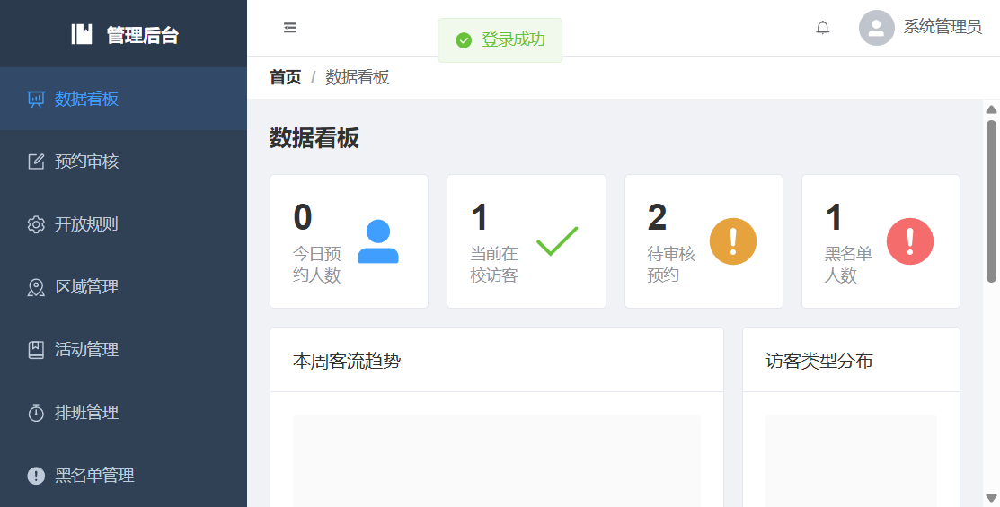
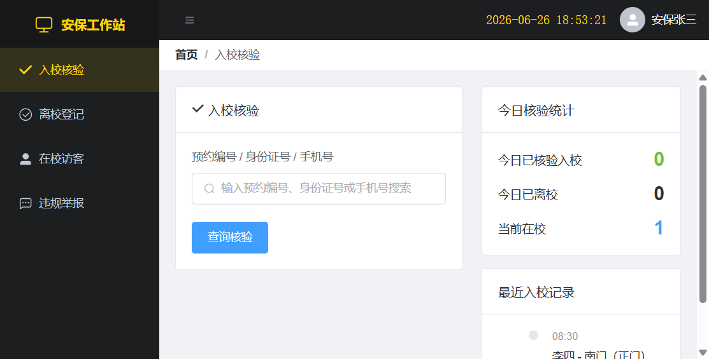
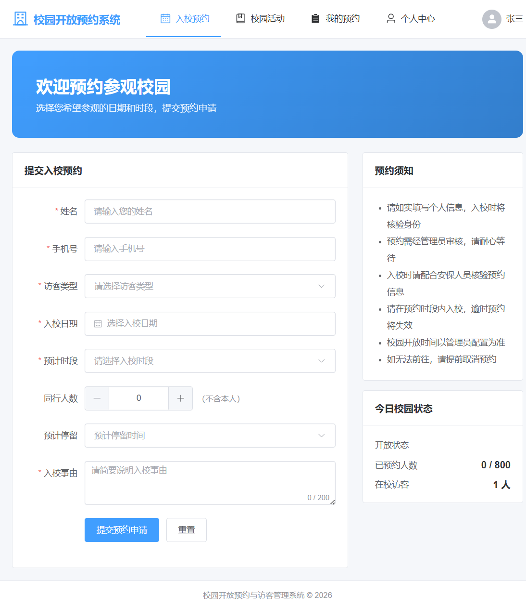
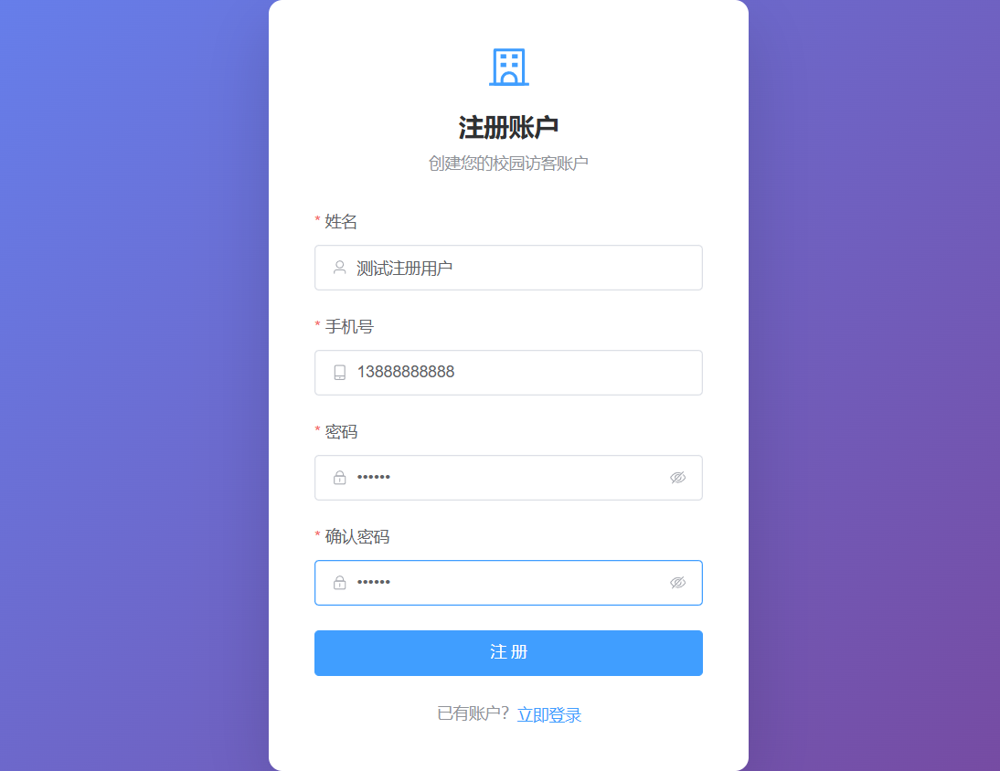

- **页面**：`/auth/login`
- **对应需求**：REQ-01
- **功能描述**：访客通过手机号注册账号（密码 BCrypt 加密存储），已有账号直接登录；管理员（13800138000）、安保（13900139001）使用预置账号登录。**黑名单用户（如张三）登录时直接返回401**，提示"您已被列入黑名单，截止 XXXX-XX-XX 前不可使用本系统"
- **前端实现**：Element Plus 表单组件，手机号正则校验，登录成功后将 JWT Token 存入 localStorage，黑名单拦截提示
- **后端实现**：`AuthController.Login()` → `AuthService.LoginAsync()` → 验证密码 → 查询黑名单 → 黑名单用户抛出 401 → 正常用户生成 JWT Token
- **数据库操作**：`SELECT * FROM Users WHERE Phone = ?` → 验证 `PasswordHash` → `SELECT FROM Blacklist WHERE UserId=? AND IsActive=1` → `UPDATE Users SET LastLoginAt = GETDATE()`

#### 功能 F2：入校预约提交

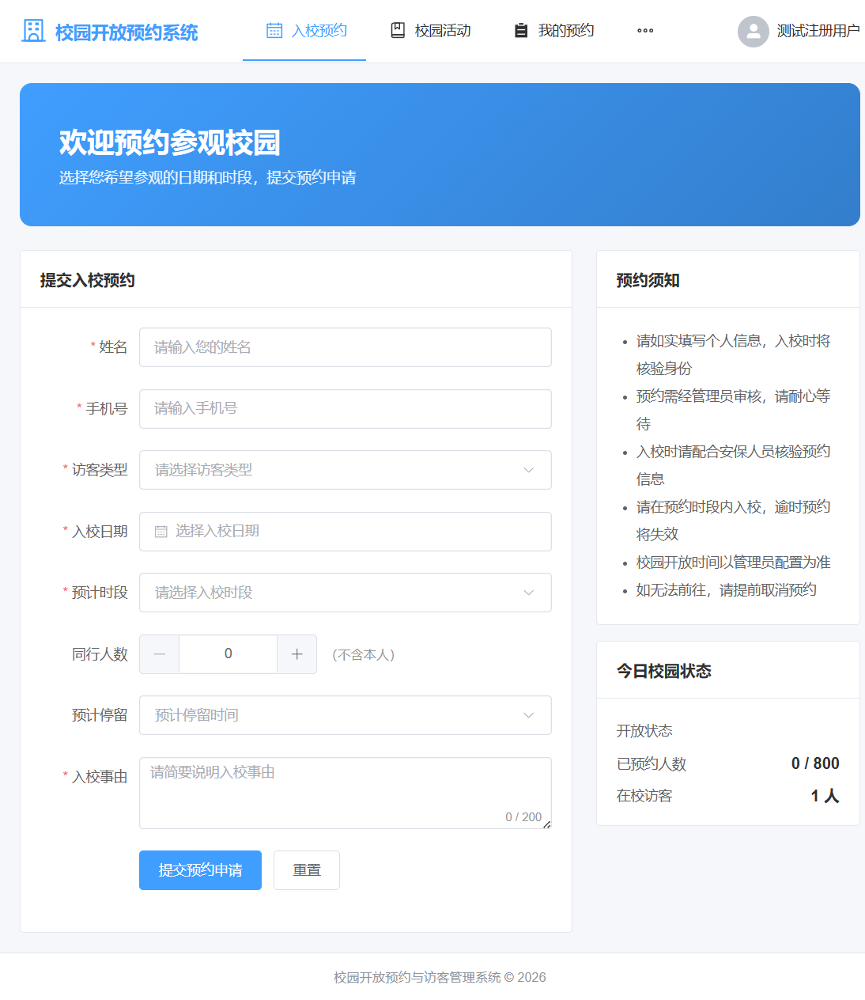


- **页面**：`/visitor/reservation`
- **对应需求**：REQ-02
- **功能描述**：访客填写姓名、手机号、选择访客类型（家长/校友/游客/研学团/合作单位）、选择入校日期和时段（上午/下午/全天）、填写同行人数和入校事由，提交预约申请
- **前端实现**：
  - 日期选择器禁用过去日期（`disabledDate` 函数）
  - 表单校验：姓名必填、手机号正则 `^1[3-9]\d{9}$`、访客类型/日期/时段/事由必填
  - 右侧展示"预约须知"和"今日校园状态"（从 `GET /api/public/campus-status` 获取实时数据）
- **后端实现**：`ReservationController.Create()` → `ReservationService.CreateAsync()` → 生成预约编号 → 插入数据库
- **数据库操作**：
  - `INSERT INTO Reservations (UserId, ReservationNo, VisitorType, VisitorName, ...) VALUES (...)`
  - 触发器自动 `INSERT INTO ReservationStatusLog (FromStatus=NULL, ToStatus='pending')`

#### 功能 F3：我的预约管理

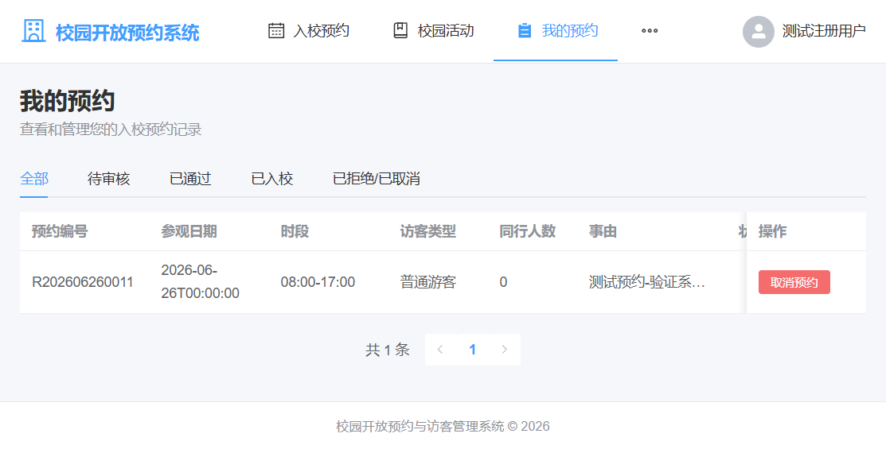

- **页面**：`/visitor/my-reservations`
- **对应需求**：REQ-02
- **功能描述**：访客查看自己的预约列表，支持按状态筛选（待审核/已通过/已拒绝/已入校/已离校），可取消"待审核"状态的预约
- **后端实现**：`ReservationController.GetMy()` → `ReservationService.GetMyReservationsAsync()` → 分页查询
- **数据库操作**：`SELECT * FROM Reservations WHERE UserId = ? AND Status = ? ORDER BY CreatedAt DESC OFFSET ? ROWS FETCH NEXT ? ROWS ONLY`

#### 功能 F4：校园活动浏览与报名


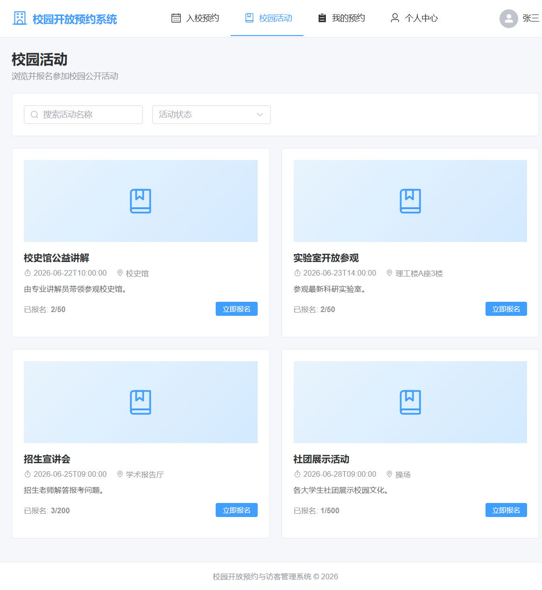

- **页面**：`/visitor/activities`
- **对应需求**：REQ-06
- **功能描述**：访客浏览已开放的活动列表，查看活动详情（标题、地点、时间、人数上限/当前报名数），点击报名
- **前端实现**：卡片列表展示活动，报名按钮在名额已满时禁用
- **后端实现**：`ActivityController.Register()` → `ActivityService.RegisterAsync()` → 名额检查和去重
- **数据库操作**：
  - `SELECT * FROM Activities WHERE Status = 'open'`（活动列表）
  - `INSERT INTO ActivityRegistrations` + `UPDATE Activities SET CurrentCount = CurrentCount + 1`（报名事务）

### 8.2 管理员端功能

#### 功能 F5：数据看板

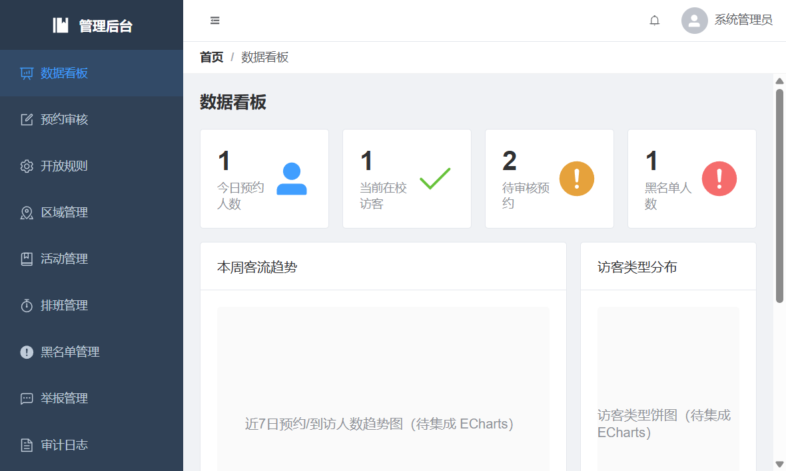

- **页面**：`/admin/dashboard`
- **对应需求**：REQ-13
- **功能描述**：展示今日预约人数、当前在校访客数、待审核预约数、黑名单人数等核心统计指标，以及客流趋势和访客类型分布图表
- **前端实现**：统计卡片 + 图表占位区（可集成 ECharts），数据从 `GET /api/admin/dashboard` 获取
- **后端实现**：`AdminController.GetDashboard()` → `AdminService.GetDashboardStatsAsync()` → 聚合查询
- **数据库操作**：
  - `SELECT COUNT(*) FROM Reservations WHERE VisitDate = CAST(GETDATE() AS DATE)`
  - `SELECT COUNT(*) FROM EntryExitRecords WHERE EntryTime IS NOT NULL AND ExitTime IS NULL`
  - `SELECT COUNT(*) FROM Reservations WHERE Status = 'pending'`
  - `SELECT COUNT(*) FROM Blacklist WHERE IsActive = 1`

#### 功能 F6：预约审核

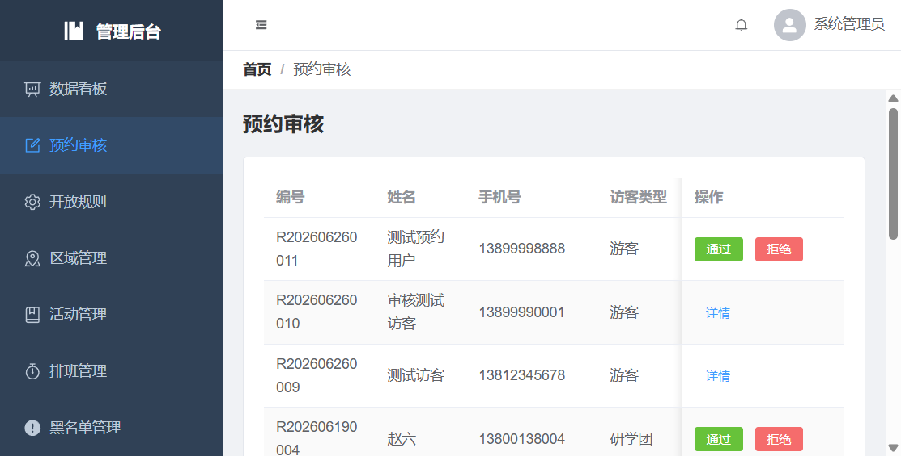
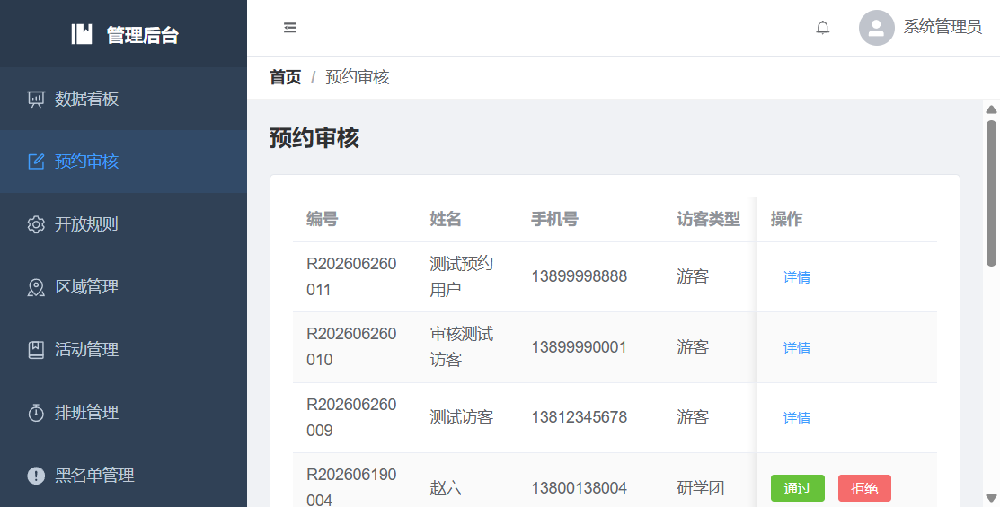

- **页面**：`/admin/review`
- **对应需求**：REQ-03
- **功能描述**：管理员查看待审核预约列表，点击查看详情，选择"通过"或"拒绝"并填写审核意见
- **前端实现**：Table 表格展示预约列表，状态标签颜色区分（warning=待审核, success=已通过, danger=已拒绝），审核对话框
- **后端实现**：`ReservationController.Review()` → `ReservationService.ReviewAsync()` → 更新状态和审核信息
- **数据库操作**：
  - `SELECT * FROM Reservations WHERE Status = 'pending' ORDER BY CreatedAt DESC`（列表）
  - `UPDATE Reservations SET Status = 'approved', ReviewerId = ?, ReviewRemark = ?, ReviewedAt = GETDATE()`（审核操作）
  - **触发器**：`INSERT INTO ReservationStatusLog (FromStatus='pending', ToStatus='approved', ...)`

#### 功能 F7：开放规则管理

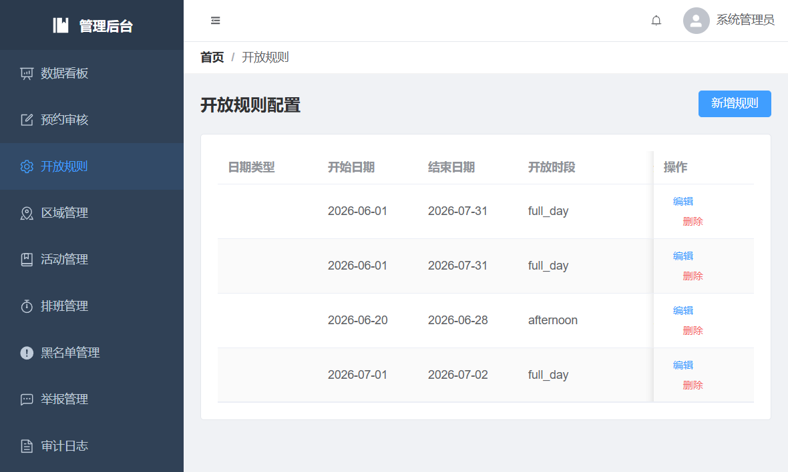

- **页面**：`/admin/open-rules`
- **对应需求**：REQ-08
- **功能描述**：管理员配置不同日期类型（工作日/周末/节假日/考试周/自定义）的开放时段、容量上限，支持启用/禁用。**新增适用区域选择器**，规则可绑定到特定校园区域进行差异化管控，未指定则为全校通用
- **数据库操作**：`INSERT/UPDATE/DELETE` 操作 `OpenRules` 表（含 `AreaId` 外键关联 `CampusAreas`）

#### 功能 F8：区域权限管理

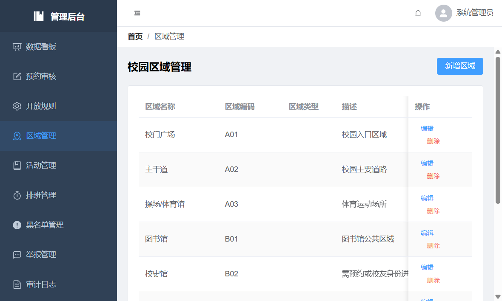

- **页面**：`/admin/areas`
- **对应需求**：REQ-09
- **功能描述**：管理员定义校园区域（名称、编码、类型、开放等级），配置每种访客类型对该区域的访问权限。**新增上午/下午开放时段选择器**，每个区域可独立设置默认开放时间，作为违规检测中"超时滞留"的时间依据
- **数据库操作**：
  - `CampusAreas` 表（区域基本信息 + MorningStart/MorningEnd/AfternoonStart/AfternoonEnd）
  - `AreaPermissions` 表（多对多关联：区域 ↔ 访客类型）
  - 使用 `ON DELETE CASCADE`，删除区域自动清除相关权限记录

#### 功能 F9：黑名单管理

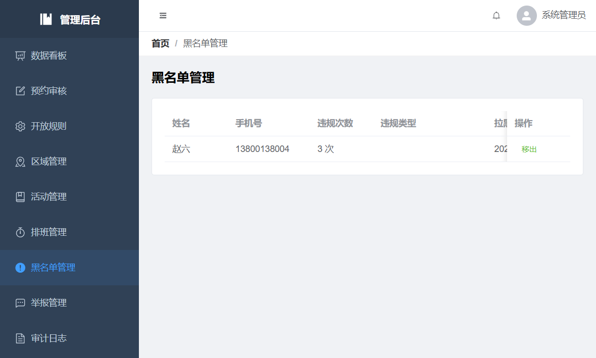

- **页面**：`/admin/blacklist`
- **对应需求**：REQ-10
- **功能描述**：管理员查看黑名单列表（含拉黑原因、违规次数、拉黑日期、到期日期），可将违规访客移出黑名单。**黑名单用户登录时被 401 拦截，预约时被拒绝**
- **自动拉黑机制**：系统每日自动检测违规记录，累计≥3次自动加入黑名单（3个月有效期）
- **数据库操作**：`UPDATE Blacklist SET IsActive = 0, UnblacklistedAt = GETDATE()`

#### 功能 F10：审计日志

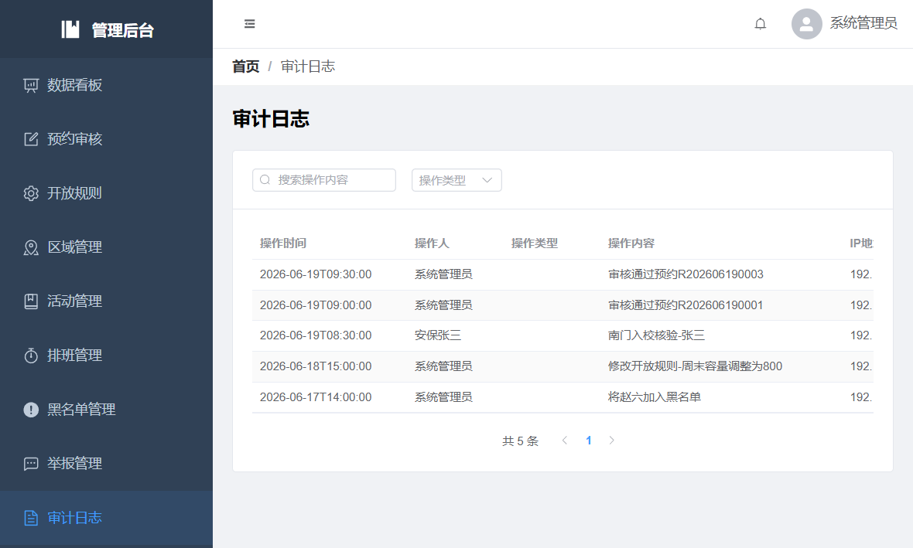

- **页面**：`/admin/audit-logs`
- **对应需求**：REQ-14
- **功能描述**：管理员查看所有后台操作的审计日志，支持按操作类型筛选（login/review/config/user_mgmt/blacklist/report/system 等）
- **数据库操作**：`SELECT * FROM AuditLogs WHERE ActionType = ? ORDER BY CreatedAt DESC`

### 8.3 安保端功能

#### 功能 F11：入校核验

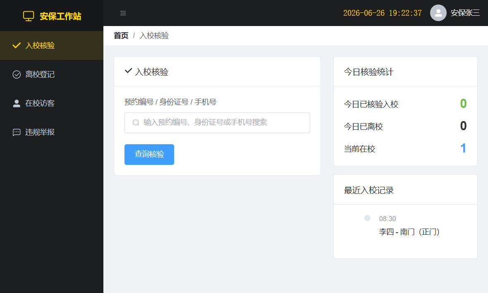
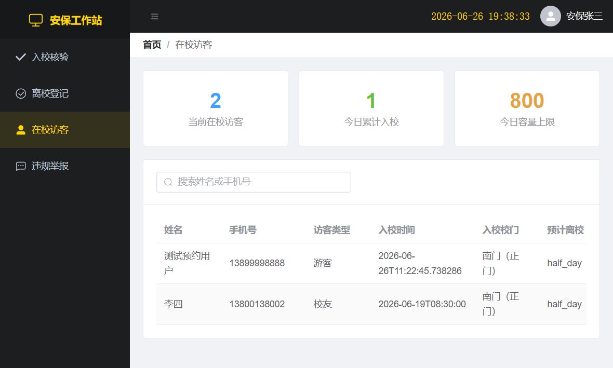

- **页面**：`/security/entry-check`
- **对应需求**：REQ-04
- **功能描述**：安保人员通过预约编号/手机号/身份证号查询预约信息，确认后点击"确认入校"，记录入校时间和校门
- **前端实现**：搜索框 + 核验结果展示（Element Plus Descriptions 组件），绿色确认按钮仅对 `status=approved` 的预约可用
- **后端实现**：`EntryExitController.Search()` → `SearchAsync()`（查询）→ `EntryExitController.Entry()` → `EntryAsync()`（入校登记）
- **数据库操作**：
  - 查询：`SELECT * FROM Reservations WHERE ReservationNo = ? OR VisitorPhone = ? OR VisitorName LIKE '%?%'`
  - 入校：`UPDATE Reservations SET Status = 'checked_in'` + `INSERT INTO EntryExitRecords (EntryTime, EntryGateId, OperatorId, ...)`
  - 触发器自动记录状态变更

#### 功能 F12：离校登记

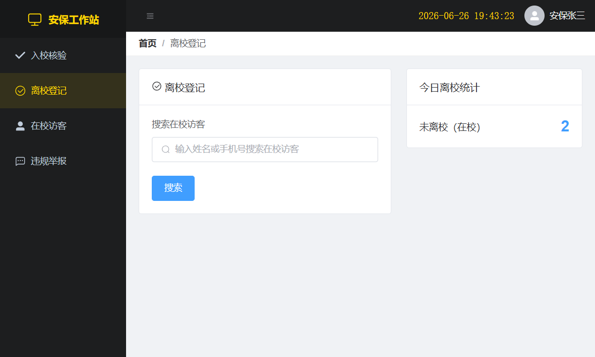
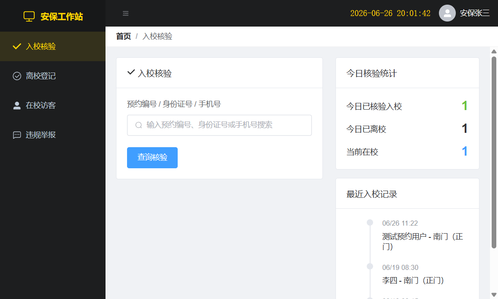

- **页面**：`/security/exit-record`
- **对应需求**：REQ-05
- **功能描述**：安保人员输入访客姓名，查询在记录中尚未离校的访客，登记离校时间和校门
- **后端实现**：`EntryExitController.Exit()` → `ExitAsync()` → 查找未离校记录 → 更新离校信息
- **数据库操作**：
  - `SELECT * FROM EntryExitRecords WHERE Reservation.VisitorName = ? AND ExitTime IS NULL`
  - `UPDATE EntryExitRecords SET ExitTime = GETDATE(), ExitGateId = ?` + `UPDATE Reservations SET Status = 'checked_out'`

#### 功能 F13：当前在校访客

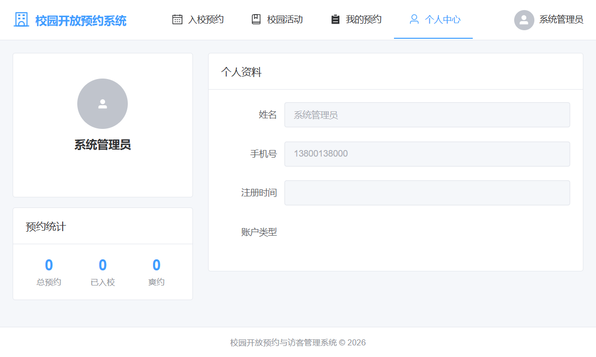

- **页面**：`/security/current-visitors`
- **对应需求**：REQ-04
- **功能描述**：展示当前在校访客列表（已入校但未离校），方便安保掌握校园内访客情况
- **数据库操作**：`SELECT * FROM EntryExitRecords WHERE EntryTime IS NOT NULL AND ExitTime IS NULL`

### 8.4 智能违规检测与黑名单机制

在完成前后端数据一致性修复后，我们进一步实现了**自动化违规检测**和**黑名单强制执行**两大增强功能。

#### 8.4.1 自动违规检测机制

系统通过 `EntryExitService.AutoDetectViolationsAsync()` 在管理员访问数据看板和安保查看在校访客时自动触发，涵盖三类检测：

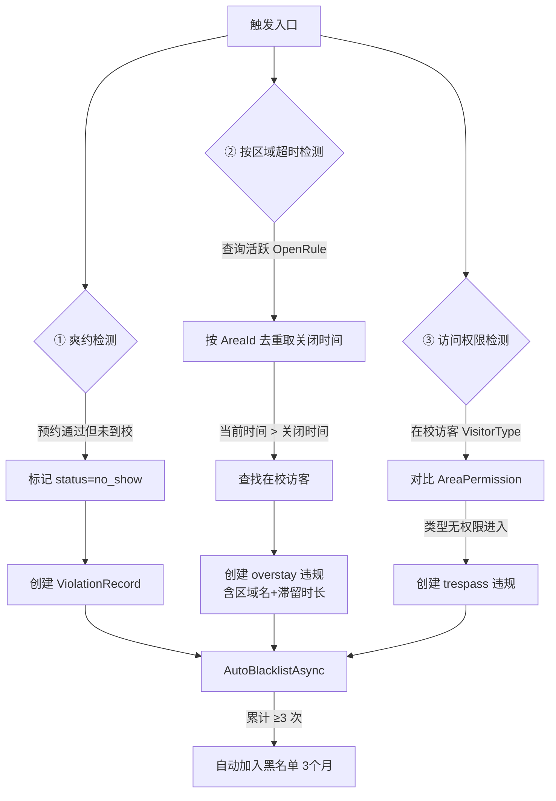
```mermaid
flowchart TD
    A[触发入口] --> B{① 爽约检测}
    A --> C{② 按区域超时检测}
    A --> D{③ 访问权限检测}
  
    B -->|预约通过但未到校| B1[标记 status=no_show]
    B1 --> B2[创建 ViolationRecord]
  
    C -->|查询活跃 OpenRule| C1[按 AreaId 去重取关闭时间]
    C1 -->|当前时间 > 关闭时间| C2[查找在校访客]
    C2 --> C3[创建 overstay 违规<br/>含区域名+滞留时长]
  
    D -->|在校访客 VisitorType| D1[对比 AreaPermission]
    D1 -->|类型无权限进入| D2[创建 trespass 违规]
  
    B2 --> E[AutoBlacklistAsync]
    C3 --> E
    D2 --> E
    E -->|累计 ≥3 次| F[自动加入黑名单 3个月]
```

**实际检测结果**：

| 检测类型            | 检测对象                           | 结果      | 详情                                             |
| ------------------- | ---------------------------------- | --------- | ------------------------------------------------ |
| 爽约 (no_show)      | 张三、王五、孙七、安保张三等 5 人  | ✅ 已标记 | 过期未到校的 approved 预约                       |
| 超时滞留 (overstay) | 李四                               | ✅ 已检测 | 入校 7 天未离校，区域「全校」关闭，滞留 180 小时 |
| 权限违规 (trespass) | 李四                               | ✅ 已检测 | 访客类型无权限进入「封闭区域」                   |
| 自动拉黑            | 张三(3次)、赵六(3次)、李四(2→4次) | ✅ 已拉黑 | 3 个月有效期                                     |

#### 8.4.2 黑名单拦截机制

**登录拦截**（`AuthService.LoginAsync`）：

```
张三 (13800138001) 登录 → 查询 Blacklist → IsActive=1, ExpiresAt > now
→ 返回 401: "您已被列入黑名单，截止 2026-09-26 前不可使用本系统。原因：系统自动检测：累计违规3次"
```

**预约拦截**（`ReservationService.CreateAsync`）：

```
黑名单用户提交预约 → 检测到 Blacklist 记录 → 
→ 抛出异常: "您已被列入黑名单，XXXX-XX-XX 前无法预约"
```

#### 8.4.3 区域-规则-违规联动

此前区域管理（`CampusAreas`）、开放规则（`OpenRules`）和违规检测三个模块相互割裂。改造后形成联动：

| 改进项                     | 改动                              | 效果                                               |
| -------------------------- | --------------------------------- | -------------------------------------------------- |
| `OpenRule.AreaId`        | 新增 FK → CampusAreas            | 规则可绑定到具体区域，null=全校通用                |
| `CampusArea.*Start/*End` | 新增 4 个时段字段                 | 每个区域有独立默认开放时间                         |
| 违规检测去区域化           | 重写`AutoDetectViolationsAsync` | 按区域关闭时间检测超时，按 AreaPermission 检测越权 |
| 去重机制                   | GroupBy AreaId + Local 检查       | 同一区域多条规则不重复创建违规                     |

#### 8.4.4 举报→违规→拉黑完整链

```
用户提交 Report → 管理员审核通过 → ReportController.Review()
  → 自动创建 ViolationRecord（SourceType=report）
  → 统计该用户累计违规次数
    → ≥3 次 → 自动 Blacklist（Reason="累计违规X次（含：举报类型）"）
      → 用户下次登录被 401 拦截
      → 用户预约被拒绝
```

---

## 9. 功能与需求对照表

| 需求编号       | 需求描述      | 实现功能                               | 前端页面                                               | 后端接口                                                        | 核心数据库表                              | 验证截图                                             |
| -------------- | ------------- | -------------------------------------- | ------------------------------------------------------ | --------------------------------------------------------------- | ----------------------------------------- | ---------------------------------------------------- |
| REQ-01         | 用户注册/登录 | F1：手机号注册登录，JWT认证+黑名单拦截 | 登录/注册页                                            | `POST /api/auth/login`, `/register`                         | Users, Blacklist                          | req01-login-*.png                                    |
| REQ-02         | 入校预约      | F2：提交预约；F3：我的预约+黑名单拦截  | `/visitor/reservation`, `/visitor/my-reservations` | `POST /api/reservations`, `GET /api/reservations/my`        | Reservations                              | req01-register-result.png, req02-my-reservations.png |
| REQ-03         | 预约审核      | F6：管理员审核预约                     | `/admin/review`                                      | `PUT /api/reservations/{id}/review`                           | Reservations, ReservationStatusLog        | req03-review-*.png                                   |
| REQ-04         | 入校核验      | F11：安保查询并确认入校                | `/security/entry-check`                              | `POST /api/entry-exit/search`, `/entry`                     | Reservations, EntryExitRecords, Gates     | req04-*.png                                          |
| REQ-05         | 离校登记      | F12：安保登记离校                      | `/security/exit-record`                              | `PUT /api/entry-exit/exit`                                    | EntryExitRecords, Reservations            | req05-*.png                                          |
| REQ-06         | 活动管理      | F4：访客浏览报名；管理员管理活动       | `/visitor/activities`, `/admin/activities`         | `GET/POST /api/activities`, `POST /api/activities/register` | Activities, ActivityRegistrations         | req06-*.png                                          |
| REQ-07         | 活动签到      | 管理员现场签到                         | `/admin/activities`                                  | `PUT /api/activities/checkin/{id}`                            | ActivityRegistrations                     | —                                                   |
| REQ-08         | 开放规则      | F7：配置开放日期/时段/容量+区域联动    | `/admin/open-rules`                                  | `GET/POST/DELETE /api/open-rules`                             | OpenRules, CampusAreas                    | req08-open-rules.png                                 |
| REQ-09         | 区域权限      | F8：定义区域+时段+访问权限             | `/admin/areas`                                       | `GET/POST/DELETE /api/areas`                                  | CampusAreas, AreaPermissions              | req09-areas.png                                      |
| REQ-10         | 黑名单管理    | F9：查看+移出+自动拉黑+登录/预约拦截   | `/admin/blacklist`                                   | `GET/DELETE /api/blacklist`                                   | Blacklist, ViolationRecords               | req10-blacklist.png                                  |
| REQ-11         | 违规举报      | 举报提交→审核→违规记录→自动拉黑     | 举报相关页面                                           | `ReportController`                                            | Reports, ViolationRecords, Blacklist      | req11-reports.png                                    |
| REQ-12         | 排班管理      | 安保/工作人员排班                      | `/admin/schedules`                                   | `GET/POST/DELETE /api/schedules`                              | StaffSchedules                            | req12-schedules.png                                  |
| REQ-13         | 数据看板      | F5：核心统计+自动触发违规检测          | `/admin/dashboard`                                   | `GET /api/admin/dashboard`                                    | 多表聚合查询                              | req13-dashboard.png                                  |
| REQ-14         | 审计日志      | F10：操作日志查看                      | `/admin/audit-logs`                                  | `GET /api/audit-logs`                                         | AuditLogs                                 | req14-audit-logs.png                                 |
| REQ-15         | 状态追溯      | 触发器自动记录+预约详情可查            | 预约详情页                                             | 预约详情接口含状态日志                                          | ReservationStatusLog（触发器写入）        | req15-profile.png                                    |
| **新增** | 自动违规检测  | 每日自动检测爽约+超时+越权             | 数据看板/在校访客触发                                  | `EntryExitService.AutoDetectViolationsAsync()`                | ViolationRecords, Reservations, OpenRules | —                                                   |
| **新增** | 自动拉黑      | 累计违规≥3次→自动3个月黑名单         | —                                                     | `EntryExitService.AutoBlacklistAsync()`                       | ViolationRecords, Blacklist               | —                                                   |
| **新增** | 区域规则联动  | 开放规则绑定区域+时段+违规检测联动     | OpenRules/Areas 页面                                   | `AdminService`, `EntryExitService`                          | OpenRules.AreaId → CampusAreas           | req08/req09                                          |

---

## 10. 前端-后端-数据库关联分析

本章选取系统中最具代表性的**三个关联业务行为**，详细分析从前端用户操作到后端业务逻辑再到数据库持久化的完整数据流。

### 10.1 业务链路一：访客预约 → 审核 → 入校 → 离校（全流程）

这是系统的**核心业务流程**，涉及 4 个角色（访客、管理员、安保 ×2 次）、4 个数据库表、1 个触发器和 5 次状态变更。

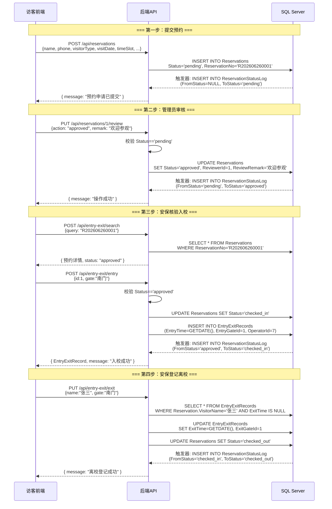
```mermaid
sequenceDiagram
    participant V as 访客前端
    participant API as 后端API
    participant DB as SQL Server

    Note over V,DB: === 第一步：提交预约 ===
    V->>API: POST /api/reservations<br/>{name, phone, visitorType, visitDate, timeSlot, ...}
    API->>DB: INSERT INTO Reservations<br/>Status='pending', ReservationNo='R202606260001'
    DB-->>API: 触发器: INSERT INTO ReservationStatusLog<br/>(FromStatus=NULL, ToStatus='pending')
    API-->>V: { message: "预约申请已提交" }

    Note over V,DB: === 第二步：管理员审核 ===
    V->>API: PUT /api/reservations/1/review<br/>{action: "approved", remark: "欢迎参观"}
    API->>API: 校验 Status=='pending'
    API->>DB: UPDATE Reservations<br/>SET Status='approved', ReviewerId=1, ReviewRemark='欢迎参观'
    DB-->>API: 触发器: INSERT INTO ReservationStatusLog<br/>(FromStatus='pending', ToStatus='approved')
    API-->>V: { message: "操作成功" }

    Note over V,DB: === 第三步：安保核验入校 ===
    V->>API: POST /api/entry-exit/search<br/>{query: "R202606260001"}
    API->>DB: SELECT * FROM Reservations<br/>WHERE ReservationNo='R202606260001'
    API-->>V: { 预约详情, status: "approved" }

    V->>API: POST /api/entry-exit/entry<br/>{id:1, gate:"南门"}
    API->>API: 校验 Status=='approved'
    API->>DB: UPDATE Reservations SET Status='checked_in'
    API->>DB: INSERT INTO EntryExitRecords<br/>(EntryTime=GETDATE(), EntryGateId=1, OperatorId=7)
    DB-->>API: 触发器: INSERT INTO ReservationStatusLog<br/>(FromStatus='approved', ToStatus='checked_in')
    API-->>V: { EntryExitRecord, message: "入校成功" }

    Note over V,DB: === 第四步：安保登记离校 ===
    V->>API: PUT /api/entry-exit/exit<br/>{name:"张三", gate:"南门"}
    API->>DB: SELECT * FROM EntryExitRecords<br/>WHERE Reservation.VisitorName='张三' AND ExitTime IS NULL
    API->>DB: UPDATE EntryExitRecords<br/>SET ExitTime=GETDATE(), ExitGateId=1
    API->>DB: UPDATE Reservations SET Status='checked_out'
    DB-->>API: 触发器: INSERT INTO ReservationStatusLog<br/>(FromStatus='checked_in', ToStatus='checked_out')
    API-->>V: { message: "离校登记成功" }
```

**数据库关联分析**：

| 步骤     | 涉及表                                              | 关联方式                                           | 数据一致性保障                                |
| -------- | --------------------------------------------------- | -------------------------------------------------- | --------------------------------------------- |
| 预约提交 | `Reservations` + `ReservationStatusLog`         | `ReservationId` 外键                             | 触发器自动记录，确保不遗漏                    |
| 审核     | `Reservations` + `Users`（审核人）              | `ReviewerId → Users.Id`                         | 外键约束 + 状态 CHECK 约束                    |
| 入校     | `Reservations` + `EntryExitRecords` + `Gates` | `ReservationId`, `EntryGateId`, `OperatorId` | 同一事务中完成状态更新和记录插入              |
| 离校     | `EntryExitRecords` + `Reservations`             | `ReservationId`                                  | 通过`ExitTime IS NULL` 条件确保只更新在记录 |

### 10.2 业务链路二：活动发布 → 报名 → 签到（并发控制）

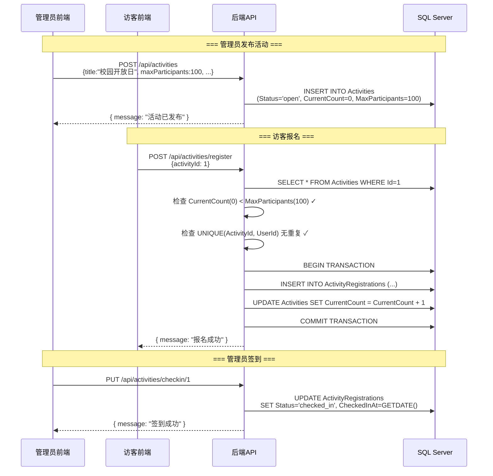
```mermaid
sequenceDiagram
    participant A as 管理员前端
    participant V as 访客前端
    participant API as 后端API
    participant DB as SQL Server

    Note over A,DB: === 管理员发布活动 ===
    A->>API: POST /api/activities<br/>{title:"校园开放日", maxParticipants:100, ...}
    API->>DB: INSERT INTO Activities<br/>(Status='open', CurrentCount=0, MaxParticipants=100)
    API-->>A: { message: "活动已发布" }

    Note over V,DB: === 访客报名 ===
    V->>API: POST /api/activities/register<br/>{activityId: 1}
    API->>DB: SELECT * FROM Activities WHERE Id=1
    API->>API: 检查 CurrentCount(0) < MaxParticipants(100) ✓
    API->>API: 检查 UNIQUE(ActivityId, UserId) 无重复 ✓
    API->>DB: BEGIN TRANSACTION
    API->>DB:   INSERT INTO ActivityRegistrations (...)
    API->>DB:   UPDATE Activities SET CurrentCount = CurrentCount + 1
    API->>DB: COMMIT TRANSACTION
    API-->>V: { message: "报名成功" }

    Note over A,DB: === 管理员签到 ===
    A->>API: PUT /api/activities/checkin/1
    API->>DB: UPDATE ActivityRegistrations<br/>SET Status='checked_in', CheckedInAt=GETDATE()
    API-->>A: { message: "签到成功" }
```

**关键数据库设计**：

- `Activities.CurrentCount` 是**冗余字段**（可从 `ActivityRegistrations` 聚合计算），但保留它通过应用层同步更新，避免每次查询活动列表时都要 `COUNT` 子查询
- `UNIQUE(ActivityId, UserId)` 约束在数据库层面兜底防止重复报名
- 报名操作在**同一事务**中完成"插入报名记录"和"递增计数"，保证数据一致性

### 10.3 业务链路三：区域权限管控

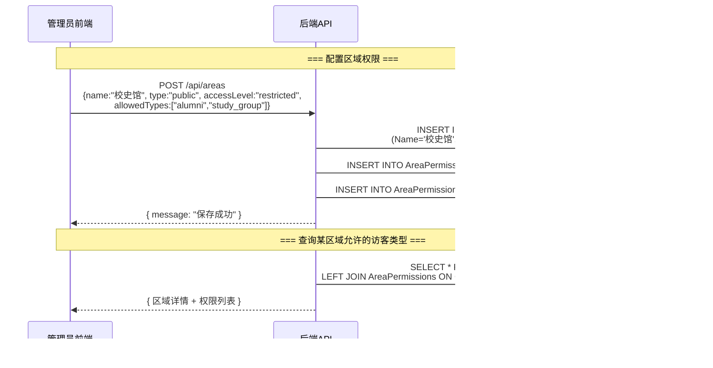
```mermaid
sequenceDiagram
    participant A as 管理员前端
    participant API as 后端API
    participant DB as SQL Server

    Note over A,DB: === 配置区域权限 ===
    A->>API: POST /api/areas<br/>{name:"校史馆", type:"public", accessLevel:"restricted",<br/> allowedTypes:["alumni","study_group"]}
    API->>DB: INSERT INTO CampusAreas<br/>(Name='校史馆', AccessLevel='restricted')
    API->>DB: INSERT INTO AreaPermissions (AreaId=5, VisitorType='alumni')
    API->>DB: INSERT INTO AreaPermissions (AreaId=5, VisitorType='study_group')
    API-->>A: { message: "保存成功" }

    Note over A,DB: === 查询某区域允许的访客类型 ===
    API->>DB: SELECT * FROM CampusAreas<br/>LEFT JOIN AreaPermissions ON CampusAreas.Id = AreaPermissions.AreaId
    API-->>A: { 区域详情 + 权限列表 }
```

**多对多关系设计说明**：

- `CampusAreas` 和访客类型之间的多对多关系通过 `AreaPermissions` 中间表实现
- `UNIQUE(AreaId, VisitorType)` 约束确保同一区域对同一访客类型不会出现重复权限记录
- `ON DELETE CASCADE`：删除区域时自动清除相关联的权限记录，防止孤儿数据
- 这种设计使系统具备良好的扩展性——新增访客类型或区域时无需修改表结构，只需增删 `AreaPermissions` 记录

### 10.4 业务链路四：违规检测 → 自动拉黑 → 黑名单拦截

这是系统的**智能安全管控链路**，涉及 5 个数据库表，通过 C# 代码在页面访问时自动触发。

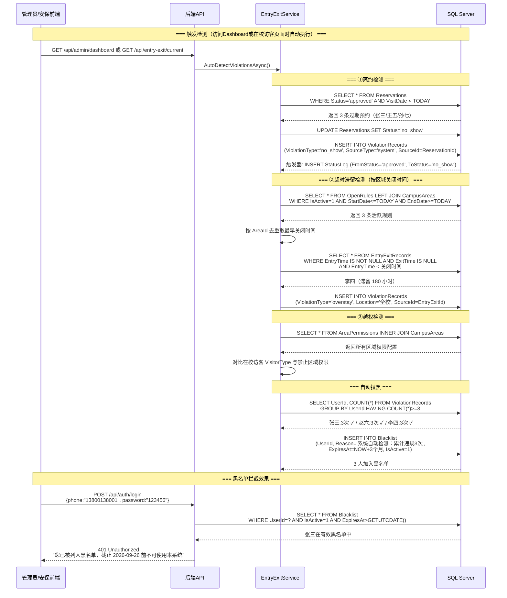
```mermaid
sequenceDiagram
    participant A as 管理员/安保前端
    participant API as 后端API
    participant SVC as EntryExitService
    participant DB as SQL Server

    Note over A,DB: === 触发检测（访问Dashboard或在校访客页面时自动执行） ===
    A->>API: GET /api/admin/dashboard 或 GET /api/entry-exit/current
    API->>SVC: AutoDetectViolationsAsync()

    Note over SVC,DB: === ①爽约检测 ===
    SVC->>DB: SELECT * FROM Reservations<br/>WHERE Status='approved' AND VisitDate < TODAY
    DB-->>SVC: 返回 3 条过期预约（张三/王五/孙七）
    SVC->>DB: UPDATE Reservations SET Status='no_show'
    SVC->>DB: INSERT INTO ViolationRecords<br/>(ViolationType='no_show', SourceType='system', SourceId=ReservationId)
    DB-->>SVC: 触发器: INSERT StatusLog (FromStatus='approved', ToStatus='no_show')

    Note over SVC,DB: === ②超时滞留检测（按区域关闭时间） ===
    SVC->>DB: SELECT * FROM OpenRules LEFT JOIN CampusAreas<br/>WHERE IsActive=1 AND StartDate<=TODAY AND EndDate>=TODAY
    DB-->>SVC: 返回 3 条活跃规则
    SVC->>SVC: 按 AreaId 去重取最早关闭时间
    SVC->>DB: SELECT * FROM EntryExitRecords<br/>WHERE EntryTime IS NOT NULL AND ExitTime IS NULL<br/>AND EntryTime < 关闭时间
    DB-->>SVC: 李四（滞留 180 小时）
    SVC->>DB: INSERT INTO ViolationRecords<br/>(ViolationType='overstay', Location='全校', SourceId=EntryExitId)

    Note over SVC,DB: === ③越权检测 ===
    SVC->>DB: SELECT * FROM AreaPermissions INNER JOIN CampusAreas
    DB-->>SVC: 返回所有区域权限配置
    SVC->>SVC: 对比在校访客 VisitorType 与禁止区域权限

    Note over SVC,DB: === 自动拉黑 ===
    SVC->>DB: SELECT UserId, COUNT(*) FROM ViolationRecords<br/>GROUP BY UserId HAVING COUNT(*)>=3
    DB-->>SVC: 张三:3次 ✓ / 赵六:3次 ✓ / 李四:3次 ✓
    SVC->>DB: INSERT INTO Blacklist<br/>(UserId, Reason='系统自动检测：累计违规3次',<br/>ExpiresAt=NOW+3个月, IsActive=1)
    DB-->>SVC: 3 人加入黑名单

    Note over A,DB: === 黑名单拦截效果 ===
    A->>API: POST /api/auth/login<br/>{phone:"13800138001", password:"123456"}
    API->>DB: SELECT * FROM Blacklist<br/>WHERE UserId=? AND IsActive=1 AND ExpiresAt>GETUTCDATE()
    DB-->>API: 张三在有效黑名单中
    API-->>A: 401 Unauthorized<br/>"您已被列入黑名单，截止 2026-09-26 前不可使用本系统"
```

**数据库关联分析**：

| 步骤     | 涉及表                                                   | 关联方式                              | 关键设计                                           |
| -------- | -------------------------------------------------------- | ------------------------------------- | -------------------------------------------------- |
| 爽约检测 | `Reservations` → `ViolationRecords`                 | `SourceId` → `Reservations.Id`   | 避免重复：检查是否已有同 UserId+Type+SourceId 违规 |
| 超时检测 | `OpenRules` ← `CampusAreas` → `EntryExitRecords` | `AreaId`, `EntryTime` vs 关闭时间 | 按 AreaId 去重，同一区域多个规则只取最早关门的     |
| 自动拉黑 | `ViolationRecords` → `Blacklist`                    | `UserId` GROUP BY                   | 拉黑前检查`Blacklist.IsActive` 避免重复拉黑      |
| 登录拦截 | `Blacklist` + `Users`                                | `UserId` JOIN                       | `ExpiresAt > GETUTCDATE()` 保证过期自动放行      |

### 10.5 业务链路五：举报 → 违规记录 → 黑名单

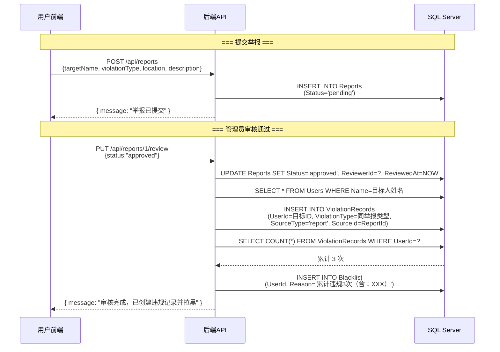
```mermaid
sequenceDiagram
    participant U as 用户前端
    participant API as 后端API
    participant DB as SQL Server

    Note over U,DB: === 提交举报 ===
    U->>API: POST /api/reports<br/>{targetName, violationType, location, description}
    API->>DB: INSERT INTO Reports<br/>(Status='pending')
    API-->>U: { message: "举报已提交" }

    Note over U,DB: === 管理员审核通过 ===
    U->>API: PUT /api/reports/1/review<br/>{status:"approved"}
    API->>DB: UPDATE Reports SET Status='approved', ReviewerId=?, ReviewedAt=NOW
    API->>DB: SELECT * FROM Users WHERE Name=目标人姓名
    API->>DB: INSERT INTO ViolationRecords<br/>(UserId=目标ID, ViolationType=同举报类型,<br/>SourceType='report', SourceId=ReportId)
    API->>DB: SELECT COUNT(*) FROM ViolationRecords WHERE UserId=?
    DB-->>API: 累计 3 次
    API->>DB: INSERT INTO Blacklist<br/>(UserId, Reason='累计违规3次（含：XXX）')
    API-->>U: { message: "审核完成，已创建违规记录并拉黑" }
```

**数据库关联分析**：

| 步骤       | 涉及表                                   | 关联方式                                       |
| ---------- | ---------------------------------------- | ---------------------------------------------- |
| 举报→违规 | `Reports` → `ViolationRecords`      | `SourceType='report'`, `SourceId=ReportId` |
| 违规→拉黑 | `ViolationRecords` → `Blacklist`    | `GROUP BY UserId HAVING COUNT(*)>=3`         |
| 同名匹配   | `Reports.TargetName` → `Users.Name` | `FirstOrDefault` 查找目标用户                |

### 10.6 业务链路六：开放规则 × 区域联动 → 违规检测

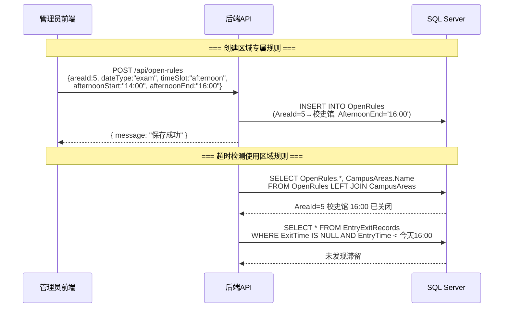
```mermaid
sequenceDiagram
    participant A as 管理员前端
    participant API as 后端API
    participant DB as SQL Server

    Note over A,DB: === 创建区域专属规则 ===
    A->>API: POST /api/open-rules<br/>{areaId:5, dateType:"exam", timeSlot:"afternoon",<br/>afternoonStart:"14:00", afternoonEnd:"16:00"}
    API->>DB: INSERT INTO OpenRules<br/>(AreaId=5→校史馆, AfternoonEnd='16:00')
    API-->>A: { message: "保存成功" }

    Note over A,DB: === 超时检测使用区域规则 ===
    API->>DB: SELECT OpenRules.*, CampusAreas.Name<br/>FROM OpenRules LEFT JOIN CampusAreas
    DB-->>API: AreaId=5 校史馆 16:00 已关闭
    API->>DB: SELECT * FROM EntryExitRecords<br/>WHERE ExitTime IS NULL AND EntryTime < 今天16:00
    DB-->>API: 未发现滞留
```

**数据库设计要点**：

- `OpenRules.AreaId`（NULL=全校通用，FK→CampusAreas ON DELETE SET NULL）
- 同一区域多条规则时按 `AreaId` 分组取最早 `AfternoonEnd`，避免重复创建违规
- 违规记录的 `Location` 字段存储区域名称（如"校史馆"），便于追溯

### 10.7 业务链路七：活动过期自动关闭

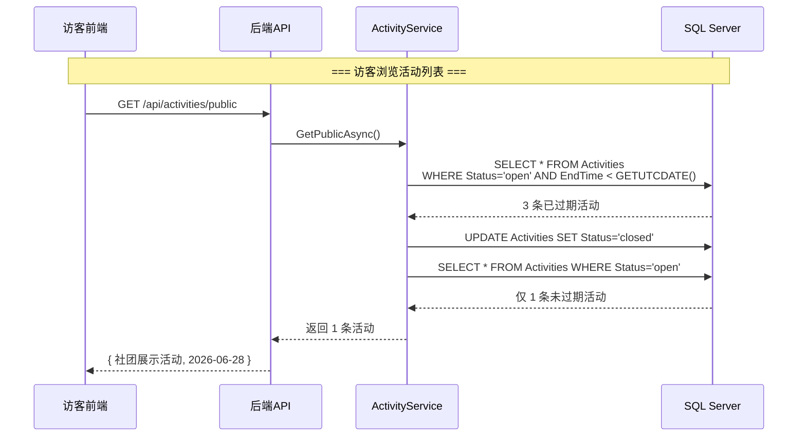
```mermaid
sequenceDiagram
    participant V as 访客前端
    participant API as 后端API
    participant SVC as ActivityService
    participant DB as SQL Server

    Note over V,DB: === 访客浏览活动列表 ===
    V->>API: GET /api/activities/public
    API->>SVC: GetPublicAsync()
    SVC->>DB: SELECT * FROM Activities<br/>WHERE Status='open' AND EndTime < GETUTCDATE()
    DB-->>SVC: 3 条已过期活动
    SVC->>DB: UPDATE Activities SET Status='closed'
    SVC->>DB: SELECT * FROM Activities WHERE Status='open'
    DB-->>SVC: 仅 1 条未过期活动
    SVC-->>API: 返回 1 条活动
    API-->>V: { 社团展示活动, 2026-06-28 }
```

**数据库操作**：每次查询活动列表/详情/报名时，自动执行 `AutoCloseExpiredAsync()`，将 `EndTime < 当前时间` 的活动从 `open` 改为 `closed`。

## 11. 总结与展望

### 11.1 项目完成情况总结

本项目完整实现了一个校园访客管理系统的前后端全栈开发，核心成果包括：

| 维度             | 完成内容                                                                                                                                                 |
| ---------------- | -------------------------------------------------------------------------------------------------------------------------------------------------------- |
| **数据库** | 设计并实现 16 张表，包含完整的 ER 关系、26+ 外键约束、15+ CHECK 约束、8 个 UNIQUE 约束、14 个非聚集索引、1 个触发器、1 个自定义函数                      |
| **后端**   | 基于 ASP.NET Core Web API 实现 7 个 Controller、5 个 Service、15 个 Model，使用 JWT + RBAC 认证授权，EF Core 作为 ORM                                    |
| **前端**   | 基于 Vue 3 + Element Plus 实现三套界面（访客端、管理员端、安保端），25+ 页面，Axios 统一请求管理，路由守卫实现页面级权限控制                             |
| **业务**   | 覆盖预约全生命周期（提交→审核→入校→离校→爽约检测）、活动管理、区域权限、开放规则、黑名单（自动拉黑+登录/预约拦截）、排班、举报、审计等 15 项功能需求 |
| **测试**   | **24 张运行截图**覆盖全部需求（REQ-01 ~ REQ-15），Sqlcmd 逐项核实数据库与前端数据一致性，端到端验证预约→审核→入校→离校全链路                    |
| **修复**   | 发现并修复**15 项前后端数据不一致问题**（硬编码假数据、API 端点映射错误、字段名不匹配等），确保所有页面展示数据与数据库完全一致                    |
| **增强**   | 新增**自动违规检测**（爽约+超时滞留+越权）、**自动拉黑**（累计≥3次）、**黑名单登录/预约拦截**、**区域-规则-违规检测联动**       |

### 11.2 技术亮点

1. **触发器实现无侵入审计**：预约状态变更日志完全由数据库触发器自动记录，应用层无需关心，任何途径修改状态都能被追溯
2. **CHECK 约束的枚举值控制**：所有状态字段都在数据库层面通过 CHECK 约束限制合法取值，比纯应用层校验更可靠
3. **多对多权限模型**：`AreaPermissions` 中间表实现区域与访客类型的灵活权限配置，`OpenRules.AreaId` 实现区域级差异化时段管理
4. **前后端分离 + JWT 认证**：符合现代 Web 开发最佳实践，前后端独立部署、独立开发
5. **分层架构**：Controller → Service → EF Core → Database，职责清晰，便于测试和维护
6. **智能违规检测**：C# 代码实现每日自动检测（非 SQL 触发器），涵盖爽约、超时滞留、越权访问三类违规，按区域关闭时间精准判断
7. **自动化黑名单**：违规→记录→累计≥3次→自动拉黑→登录拦截→预约拒绝，全程无需人工干预

### 11.3 不足与改进方向

| 不足                                   | 改进方向                                                      |
| -------------------------------------- | ------------------------------------------------------------- |
| 活动报名在高并发下可能出现超卖         | 使用数据库行锁（`SELECT ... FOR UPDATE`）或乐观锁（版本号） |
| 预约编号由应用层生成，存在并发冲突风险 | 改用数据库 SEQUENCE 或`GenerateReservationNo` 函数          |
| 缺少数据可视化图表                     | 集成 ECharts 实现客流趋势图和访客类型饼图                     |
| 缺少文件上传功能                       | 活动封面图、举报证据等目前仅支持 URL，可扩展为文件上传        |
| 缺少消息通知                           | 预约审核结果可通过短信或站内信通知访客                        |

---

> **项目仓库**：[https://github.com/eiyovai/database](https://github.com/eiyovai/database)
> **技术栈**：SQL Server 2019 + ASP.NET Core 8.0 + Vue 3 + Element Plus + Vite
